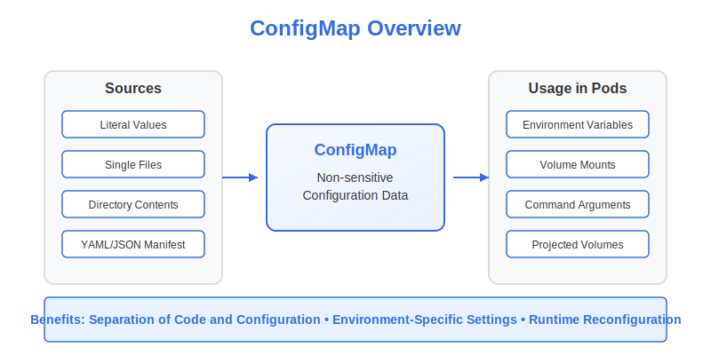

# ConfigMap Fundamentals



## What are ConfigMaps?

A ConfigMap is a Kubernetes API object used to store non-sensitive configuration data in key-value pairs. ConfigMaps serve a critical purpose: **they decouple configuration from application code and container images**. This separation enables you to:

- Keep your container images generic and reusable
- Change configuration without rebuilding images
- Use the same application across different environments (development, testing, production)
- Follow container best practices by maintaining immutable application images

ConfigMaps can store:
- Individual key-value pairs
- Entire configuration files
- JSON/YAML formatted data
- Plain text strings

## Creating ConfigMaps

There are two primary approaches to creating ConfigMaps in Kubernetes:

### 1. Imperative Approach (Using kubectl commands)

The imperative approach is faster for quick operations and is often useful during development or for the CKAD exam.

#### From Literal Values

```bash
# Basic syntax
kubectl create configmap <name> --from-literal=<key>=<value>

# Example with a single key-value pair
kubectl create configmap app-config --from-literal=app.environment=production

# Example with multiple key-value pairs
kubectl create configmap app-config \
    --from-literal=app.environment=production \
    --from-literal=app.log-level=info \
    --from-literal=app.max-connections=100
```

> **Note**: Key names can only contain alphanumeric characters, dashes (`-`), underscores (`_`), and dots (`.`).

#### From Files

To create a ConfigMap from a file's contents:

```bash
# Basic syntax
kubectl create configmap <name> --from-file=<key>=<file-path>

# Examples
kubectl create configmap nginx-config --from-file=nginx.conf=/path/to/nginx.conf

# Using the filename as the key (omitting the key= part)
kubectl create configmap nginx-config --from-file=/path/to/nginx.conf
```

#### From Directories

You can create a ConfigMap from all files in a directory:

```bash
kubectl create configmap app-config --from-file=/path/to/config/dir/
```

When creating from a directory:
- Each file becomes a separate entry in the ConfigMap
- The filename becomes the key
- The file content becomes the value
- Subdirectories, symbolic links, devices, and pipes are ignored
- Files with names that aren't valid ConfigMap keys are skipped

#### From Environment Files

You can create ConfigMaps from files containing key-value pairs (like `.env` files):

```bash
# env-file format example:
# KEY1=VALUE1
# KEY2=VALUE2

kubectl create configmap app-env --from-env-file=/path/to/.env
```

### 2. Declarative Approach (Using YAML Manifests)

The declarative approach involves creating a YAML manifest file and applying it with `kubectl`. This method is preferred for production environments and version-controlled configurations.

```yaml
apiVersion: v1
kind: ConfigMap
metadata:
  name: app-config
data:
  # Simple key-value pairs
  app.environment: production
  app.log-level: info
  app.max-connections: "100"
  
  # Configuration file as a multi-line string
  app.properties: |
    server.port=8080
    spring.application.name=myapp
    management.endpoints.web.exposure.include=health,info,metrics
    
  # JSON configuration
  config.json: |
    {
      "environment": "production",
      "features": {
        "authentication": true,
        "authorization": true,
        "rateLimit": {
          "enabled": true,
          "limit": 100
        }
      }
    }
```

Apply the manifest with:
```bash
kubectl apply -f configmap.yaml
```

#### Using Binary Data

For binary data (or if you prefer Base64 encoding), you can use the `binaryData` field:

```yaml
apiVersion: v1
kind: ConfigMap
metadata:
  name: binary-config
binaryData:
  # Base64-encoded binary data
  sample.bin: SGVsbG8gV29ybGQh
data:
  # Regular text data can still be included
  config.txt: Hello World
```

## Managing ConfigMaps

### Viewing ConfigMaps

```bash
# List all ConfigMaps in the current namespace
kubectl get configmaps

# List with more details
kubectl get configmaps -o wide

# Get detailed info about a specific ConfigMap
kubectl describe configmap <name>

# View the manifest of a ConfigMap
kubectl get configmap <name> -o yaml
```

### Editing ConfigMaps

You can edit existing ConfigMaps:

```bash
# Interactive edit
kubectl edit configmap <name>

# Direct update using patch
kubectl patch configmap <name> --patch '{"data":{"key1":"new-value"}}'
```

### Deleting ConfigMaps

```bash
kubectl delete configmap <name>
```

## ConfigMap Limitations and Best Practices

### Limitations

- ConfigMaps are limited to 1MB in size
- Key names must be valid DNS subdomain names
- ConfigMaps are not suitable for sensitive data (use Secrets instead)
- ConfigMaps are stored in plaintext in etcd

### Best Practices

1. **Group Related Data**: Organize related configuration data in a single ConfigMap rather than creating many small ConfigMaps.

2. **Use Meaningful Names**: Name ConfigMaps descriptively to indicate their purpose and content.

3. **Version Control**: Keep ConfigMap definitions in version control, especially for declarative management.

4. **Namespace Scope**: Remember that ConfigMaps are namespace-scoped resources. They must be in the same namespace as the Pods that use them.

5. **Avoid Sensitive Data**: Never store sensitive information like passwords, tokens, or keys in ConfigMaps. Use Secrets for that purpose.

6. **Documentation**: Document the purpose of each key in your ConfigMaps, especially for complex configurations.

## In the CKAD Exam

For the CKAD exam, make sure you can:

- Create ConfigMaps using both imperative and declarative approaches
- Create ConfigMaps from literals, files, and directories
- Display and interpret ConfigMap data
- Understand the structure of a ConfigMap YAML manifest

---

In the next section, we'll explore how to use ConfigMaps within Pods to configure applications.
