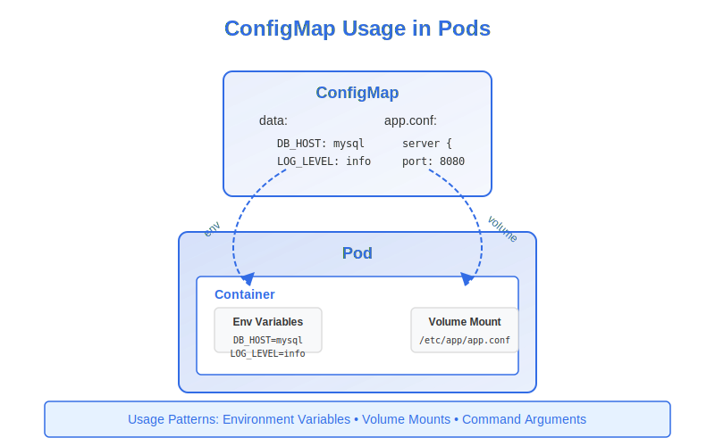
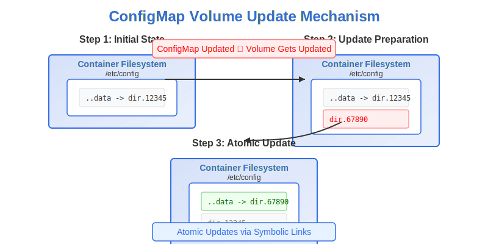

# Using ConfigMaps in Pods



Once you've created ConfigMaps to store your application configuration, you need to make them available to your applications running in Pods. Kubernetes provides several methods to consume ConfigMap data:

1. Environment variables
2. Volume mounts
3. Command-line arguments

## Using ConfigMaps as Environment Variables

Environment variables are a common way for applications to read configuration. Kubernetes provides two approaches to inject ConfigMap data as environment variables:

### 1. Individual Environment Variables

You can set specific environment variables in a container by referencing individual ConfigMap entries:

```yaml
apiVersion: v1
kind: Pod
metadata:
  name: app-pod
spec:
  containers:
  - name: app-container
    image: nginx:1.19
    env:
    - name: ENV_NAME                      # Name of environment variable
      valueFrom:
        configMapKeyRef:
          name: app-config                # Name of the ConfigMap
          key: app.environment            # Key within the ConfigMap
          optional: true                  # Container starts even if ConfigMap/key is missing
```

In this example:
- The environment variable `ENV_NAME` inside the container will have the value from the `app.environment` key in the `app-config` ConfigMap.
- The `optional: true` field means the container will start even if the ConfigMap or key doesn't exist.

### 2. All ConfigMap Entries (envFrom)

To inject all key-value pairs from a ConfigMap as environment variables:

```yaml
apiVersion: v1
kind: Pod
metadata:
  name: app-pod
spec:
  containers:
  - name: app-container
    image: nginx:1.19
    envFrom:
    - configMapRef:
        name: app-config                  # Name of the ConfigMap
        optional: true                    # Pod starts even if ConfigMap is missing
```

With `envFrom`:
- Each key in the ConfigMap becomes an environment variable name
- Each value becomes the corresponding environment variable value
- If a key in the ConfigMap is not a valid environment variable name (contains invalid characters), it will be skipped
- You can prefix all environment variables using the `prefix` field

```yaml
envFrom:
- configMapRef:
    name: app-config
    prefix: CONFIG_                        # Adds CONFIG_ prefix to all env vars
```

### Environment Variable Precedence

If you use both `env` and `envFrom` and have conflicts:
- Variables defined in `env` take precedence over those from `envFrom`
- If multiple ConfigMaps in `envFrom` have the same key, the last ConfigMap in the array wins

## Using ConfigMaps as Volumes

For configuration files or larger blocks of data, mounting ConfigMaps as volumes is often more appropriate:

```yaml
apiVersion: v1
kind: Pod
metadata:
  name: app-pod
spec:
  volumes:
  - name: config-volume                    # Define volume name
    configMap:
      name: app-config                     # Reference to the ConfigMap
  containers:
  - name: app-container
    image: nginx:1.19
    volumeMounts:
    - name: config-volume                  # Mount the defined volume
      mountPath: /etc/config               # Path inside the container
```

With this configuration:
- Each key in the ConfigMap becomes a file in the `/etc/config` directory
- The filename is the key name
- The file content is the value

### Mounting Specific Items

You can selectively mount only specific items from a ConfigMap:

```yaml
volumes:
- name: config-volume
  configMap:
    name: app-config
    items:                                 # Select specific items
    - key: app.properties                  # Key in the ConfigMap
      path: application.properties         # Filename in the volume
    - key: logging.conf
      path: log4j.properties
```

In this example, only two files will be created in the mount directory:
- `/etc/config/application.properties` (from the `app.properties` key)
- `/etc/config/log4j.properties` (from the `logging.conf` key)

### Setting File Permissions

You can set permissions for all files in the volume:

```yaml
volumes:
- name: config-volume
  configMap:
    name: app-config
    defaultMode: 0600                      # Read/write for owner only
```

Or for individual files:

```yaml
volumes:
- name: config-volume
  configMap:
    name: app-config
    items:
    - key: app.properties
      path: application.properties
      mode: 0400                           # Read-only for owner
```

### Mounting at a Specific Path

You can mount a ConfigMap at a specific subpath within the container:

```yaml
volumeMounts:
- name: config-volume
  mountPath: /etc/nginx/nginx.conf         # Specific file path
  subPath: nginx.conf                      # Key in the ConfigMap
```

> **Important**: Using `subPath` prevents automatic updates when the ConfigMap changes.

## How ConfigMap Volume Updates Work



Kubernetes updates mounted ConfigMaps automatically when the ConfigMap is modified:

1. When a ConfigMap volume is mounted, Kubernetes creates symbolic links in the volume
2. Each symbolic link points to a file in a hidden directory
3. The special `.data` symlink points to the currently active directory
4. When you update the ConfigMap, Kubernetes:
   - Creates a new timestamped directory
   - Writes the updated files to this directory
   - Atomically updates the `.data` symlink to point to the new directory

This ensures applications see a consistent view of the configuration.

The update process is:
- Completely atomic (no partial updates)
- Eventually consistent (may take up to a minute to propagate)
- Not applied when using `subPath` in your `volumeMount`

## Using ConfigMaps for Command-line Arguments

You can use ConfigMap data to define container command arguments:

```yaml
apiVersion: v1
kind: Pod
metadata:
  name: app-pod
spec:
  containers:
  - name: app-container
    image: myapp:1.5
    command: ["./app"]
    args: ["--config-path", "$(CONFIG_PATH)"]
    env:
    - name: CONFIG_PATH
      valueFrom:
        configMapKeyRef:
          name: app-config
          key: config-path
```

In this example, the application runs with a command-line argument that comes from the ConfigMap value.

## Common Use Cases and Patterns

### 1. Application Configuration Files

Mount configuration files directly for applications like nginx, MySQL, or Spring Boot:

```yaml
# First, create the ConfigMap with the config file
apiVersion: v1
kind: ConfigMap
metadata:
  name: nginx-conf
data:
  nginx.conf: |
    server {
      listen 80;
      server_name example.com;
      
      location / {
        root /usr/share/nginx/html;
        index index.html;
      }
    }

---
# Then mount it in the Pod
apiVersion: v1
kind: Pod
metadata:
  name: nginx-pod
spec:
  containers:
  - name: nginx
    image: nginx:1.19
    volumeMounts:
    - name: nginx-config
      mountPath: /etc/nginx/conf.d/default.conf
      subPath: nginx.conf
  volumes:
  - name: nginx-config
    configMap:
      name: nginx-conf
```

### 2. Environment-Specific Configuration

Use different ConfigMaps for different environments:

```yaml
# Development ConfigMap
apiVersion: v1
kind: ConfigMap
metadata:
  name: app-config
  namespace: development
data:
  app.environment: "development"
  log.level: "debug"
  api.url: "http://dev-api:8080"

---
# Production ConfigMap (same name, different namespace)
apiVersion: v1
kind: ConfigMap
metadata:
  name: app-config
  namespace: production
data:
  app.environment: "production"
  log.level: "info"
  api.url: "http://prod-api:8080"
```

Your Pod definition can stay the same across environments, referencing the same ConfigMap name.

### 3. Feature Flags

Toggle features by changing ConfigMap values:

```yaml
apiVersion: v1
kind: ConfigMap
metadata:
  name: feature-flags
data:
  feature.new-ui: "true"
  feature.beta-api: "false"
  feature.metrics: "true"
```

## Best Practices for Using ConfigMaps

1. **Appropriate Usage**: Use environment variables for simple configuration and volume mounts for complex configuration files.

2. **Restart Awareness**: Be aware that changes to environment variables from ConfigMaps require Pod restarts to take effect. Only volume mounts update automatically.

3. **Application Compatibility**: Make sure your application can handle dynamic configuration updates if you're relying on automatic ConfigMap volume updates.

4. **Avoid `subPath` for Dynamic Updates**: If you need automatic updates, avoid using `subPath` in your volume mounts.

5. **Validation**: Validate your configuration data before creating ConfigMaps to avoid application failures due to misconfiguration.

6. **ReadOnly Mounts**: When possible, mount configuration volumes as read-only to follow the principle of least privilege:

   ```yaml
   volumeMounts:
   - name: config-volume
     mountPath: /etc/config
     readOnly: true
   ```

7. **Health Checks**: Configure appropriate health checks that verify your application can read its configuration correctly.

## Troubleshooting ConfigMap Issues

Common issues when working with ConfigMaps include:

1. **Missing or Invalid Keys**: If a required key is missing or invalid, container startup can fail. Use the `optional: true` flag for keys that aren't strictly required.

2. **ConfigMap Size Limitations**: ConfigMaps are limited to 1MB in size. For larger configurations, consider breaking them into multiple ConfigMaps or using alternative solutions.

3. **Update Propagation Delay**: Changes to ConfigMaps mounted as volumes may take some time to propagate (up to a minute). Account for this in your deployment strategy.

4. **Permissions Issues**: Ensure the file permissions set with `defaultMode` or individual item `mode` are appropriate for your application.

## In the CKAD Exam

For the CKAD exam, be prepared to:

- Create Pods that consume ConfigMap data via environment variables and volumes
- Understand the different ways to reference ConfigMap entries
- Know how to selectively mount specific ConfigMap keys
- Handle scenarios where ConfigMaps might be missing (using `optional: true`)
- Understand the behavior of ConfigMap updates and when they take effect

---

In the next section, we'll explore Kubernetes Secrets, which provide similar functionality to ConfigMaps but with additional security features for sensitive data.
