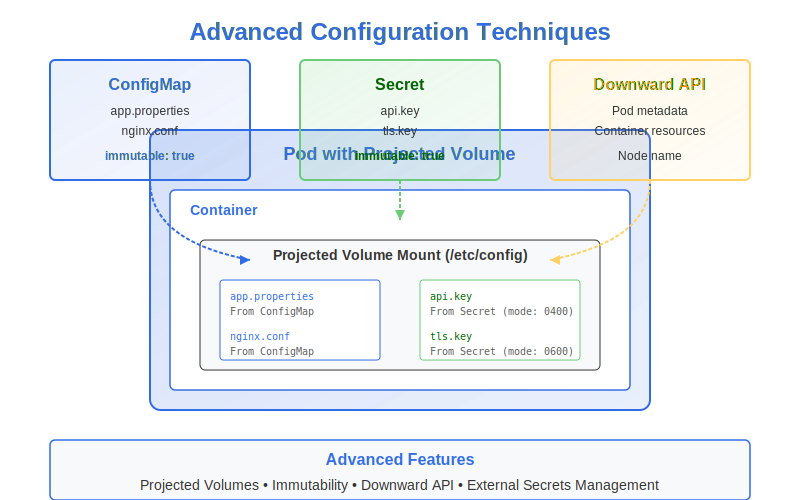

# Advanced Techniques for ConfigMaps and Secrets



In this section, we'll explore some more advanced techniques and features for managing configuration data in Kubernetes.

## Projected Volumes

Projected volumes are a special volume type that allows you to combine data from multiple sources into a single directory in your container. This is particularly useful when you need to access configuration data from different sources in the same location.

A projected volume can combine data from:
- ConfigMaps
- Secrets
- Downward API (Pod/container metadata)
- ServiceAccount tokens

### Projected Volume Example

```yaml
apiVersion: v1
kind: Pod
metadata:
  name: projected-volume-demo
spec:
  containers:
  - name: app
    image: nginx:1.19
    volumeMounts:
    - name: config-volume
      mountPath: /etc/config
      readOnly: true
  volumes:
  - name: config-volume
    projected:
      sources:
      - configMap:                      # Source 1: ConfigMap
          name: app-config
          items:
          - key: app.properties
            path: app.properties
      - secret:                         # Source 2: Secret
          name: app-secrets
          items:
          - key: api-key
            path: api.key
            mode: 0400                  # Custom permissions
      - downwardAPI:                    # Source 3: Downward API
          items:
          - path: "namespace"
            fieldRef:
              fieldPath: metadata.namespace
          - path: "cpu-limit"
            resourceFieldRef:
              containerName: app
              resource: limits.cpu
      - serviceAccountToken:            # Source 4: ServiceAccount token
          path: token
          expirationSeconds: 3600
```

In this example:
- `/etc/config/app.properties` comes from the ConfigMap `app-config`
- `/etc/config/api.key` comes from the Secret `app-secrets` with 0400 permissions
- `/etc/config/namespace` contains the current namespace name
- `/etc/config/cpu-limit` contains the CPU limit of the container
- `/etc/config/token` contains a short-lived ServiceAccount token

### Benefits of Projected Volumes

1. **Unified Configuration**: Access data from multiple sources in a single location
2. **Individual Permissions**: Set specific file permissions for each item
3. **Atomic Updates**: All sources are updated atomically
4. **Decoupled Sources**: Keep sensitive data in Secrets and non-sensitive in ConfigMaps

## Immutable ConfigMaps and Secrets

Kubernetes 1.19+ supports making ConfigMaps and Secrets immutable, which offers several benefits:

1. **Performance Improvement**: The control plane doesn't need to monitor immutable objects for changes
2. **Protection Against Accidental Updates**: Prevents accidentally modifying critical configuration
3. **Reduces Load on kube-apiserver**: Immutable objects generate fewer watch events

### Creating Immutable ConfigMaps and Secrets

To make a ConfigMap or Secret immutable, add the `immutable: true` field:

```yaml
apiVersion: v1
kind: ConfigMap
metadata:
  name: app-config
data:
  app.properties: |
    environment=production
    log.level=info
immutable: true                         # Makes this ConfigMap immutable
```

```yaml
apiVersion: v1
kind: Secret
metadata:
  name: db-credentials
type: Opaque
stringData:
  username: admin
  password: s3cr3t
immutable: true                         # Makes this Secret immutable
```

### Handling Immutable Configuration

Once a ConfigMap or Secret is marked as immutable:
- You cannot change its data fields
- The only way to update is to delete and recreate it
- You must also restart any Pods using the ConfigMap or Secret

This requires careful planning for updates:

1. Create a new ConfigMap/Secret with a different name
2. Update deployments to reference the new object
3. Remove the old ConfigMap/Secret once no Pods reference it

Example update process:

```bash
# Create new ConfigMap with updated data
kubectl create configmap app-config-v2 --from-file=app.properties=path/to/new-app.properties

# Update deployment to use the new ConfigMap
kubectl set volumes deployment/app-deployment \
  --add --name=config-volume \
  --type=configmap \
  --configmap-name=app-config-v2 \
  --mount-path=/etc/config
```

## The Downward API

The Downward API allows Pods to access their own metadata and the resources assigned to them, without needing to contact the Kubernetes API directly.

You can access this information through:
1. Environment variables
2. Files in a downwardAPI volume

### Downward API as Environment Variables

```yaml
apiVersion: v1
kind: Pod
metadata:
  name: downward-api-env
  labels:
    app: web
    tier: frontend
spec:
  containers:
  - name: main
    image: busybox
    command: ["sleep", "3600"]
    env:
    - name: POD_NAME
      valueFrom:
        fieldRef:
          fieldPath: metadata.name
    - name: POD_NAMESPACE
      valueFrom:
        fieldRef:
          fieldPath: metadata.namespace
    - name: POD_IP
      valueFrom:
        fieldRef:
          fieldPath: status.podIP
    - name: NODE_NAME
      valueFrom:
        fieldRef:
          fieldPath: spec.nodeName
    - name: CPU_LIMIT
      valueFrom:
        resourceFieldRef:
          containerName: main
          resource: limits.cpu
```

### Downward API as Volume

```yaml
apiVersion: v1
kind: Pod
metadata:
  name: downward-api-volume
  labels:
    app: web
    tier: frontend
spec:
  containers:
  - name: main
    image: busybox
    command: ["sleep", "3600"]
    volumeMounts:
    - name: podinfo
      mountPath: /etc/podinfo
  volumes:
  - name: podinfo
    downwardAPI:
      items:
      - path: "labels"
        fieldRef:
          fieldPath: metadata.labels
      - path: "annotations"
        fieldRef:
          fieldPath: metadata.annotations
      - path: "cpu-request"
        resourceFieldRef:
          containerName: main
          resource: requests.cpu
          divisor: 1m
```

### Available Fields for Downward API

**fieldRef** (Pod-level information):
- `metadata.name` - Pod name
- `metadata.namespace` - Namespace 
- `metadata.uid` - Pod UID
- `metadata.labels` - All Pod labels
- `metadata.annotations` - All Pod annotations
- `spec.nodeName` - Node name
- `spec.serviceAccountName` - ServiceAccount name
- `status.hostIP` - Host IP
- `status.podIP` - Pod IP

**resourceFieldRef** (Container-level information):
- `requests.cpu` - CPU requests
- `limits.cpu` - CPU limits
- `requests.memory` - Memory requests
- `limits.memory` - Memory limits
- `requests.ephemeral-storage` - Ephemeral storage requests
- `limits.ephemeral-storage` - Ephemeral storage limits

## Enterprise Secrets Management

While Kubernetes Secrets are sufficient for many use cases, enterprise environments often require more advanced secrets management solutions.

### External Secrets Operator

The External Secrets Operator (ESO) is a Kubernetes operator that integrates with external secret management systems:

1. It retrieves secrets from external systems and injects them into Kubernetes as regular Secret objects
2. It automatically rotates the secrets when they change in the external system
3. It supports various external providers:
   - AWS Secrets Manager & Parameter Store
   - Azure Key Vault
   - Google Secret Manager
   - HashiCorp Vault
   - Many others

Example ExternalSecret resource:

```yaml
apiVersion: external-secrets.io/v1beta1
kind: ExternalSecret
metadata:
  name: database-credentials
spec:
  refreshInterval: 1h
  secretStoreRef:
    name: vault-backend
    kind: ClusterSecretStore
  target:
    name: db-credentials
  data:
  - secretKey: username
    remoteRef:
      key: database/credentials
      property: username
  - secretKey: password
    remoteRef:
      key: database/credentials
      property: password
```

### Sealed Secrets

Sealed Secrets allows you to encrypt your Secrets so they can be safely stored in version control:

1. You encrypt your Secret using the `kubeseal` command-line tool
2. The encrypted Secret (SealedSecret) is stored in your Git repository
3. The SealedSecret controller in your cluster decrypts the SealedSecret
4. The decrypted Secret is created in your cluster

Example workflow:

```bash
# Create a Secret
kubectl create secret generic db-creds \
  --from-literal=username=admin \
  --from-literal=password=s3cr3t \
  --dry-run=client -o yaml > db-creds-secret.yaml

# Encrypt the Secret
kubeseal --format yaml < db-creds-secret.yaml > db-creds-sealed.yaml

# Apply the SealedSecret
kubectl apply -f db-creds-sealed.yaml
```

### Vault Agent Injector

HashiCorp's Vault Agent Injector automatically injects secrets from Vault into Kubernetes Pods using init containers and annotations:

```yaml
apiVersion: v1
kind: Pod
metadata:
  name: vault-demo
  annotations:
    vault.hashicorp.com/agent-inject: "true"
    vault.hashicorp.com/agent-inject-secret-database-creds: "database/creds/db-app"
    vault.hashicorp.com/role: "db-app"
spec:
  containers:
  - name: app
    image: app:1.0
```

With these annotations, Vault Agent Injector will:
1. Add an init container that authenticates with Vault
2. Fetch the specified secrets
3. Write them to a shared volume
4. Your app container can then read secrets from the volume

## Cloud Provider Solutions

Each major cloud provider offers native solutions for Kubernetes secrets management:

- **AWS**: EKS Secrets CSI Driver integrates with AWS Secrets Manager
- **Azure**: Azure Key Vault Provider for Secrets Store CSI Driver
- **GCP**: GCP Secret Manager Provider for Secrets Store CSI Driver

These solutions typically mount secrets as files in Pods using the Secrets Store CSI Driver.

Example using Azure Key Vault:

```yaml
apiVersion: secrets-store.csi.x-k8s.io/v1
kind: SecretProviderClass
metadata:
  name: azure-kv-provider
spec:
  provider: azure
  parameters:
    usePodIdentity: "true"
    keyvaultName: "my-keyvault"
    objects: |
      array:
        - |
          objectName: db-password
          objectType: secret
---
apiVersion: v1
kind: Pod
metadata:
  name: app-pod
spec:
  containers:
  - name: app
    image: app:1.0
    volumeMounts:
    - name: secrets-store
      mountPath: "/mnt/secrets"
      readOnly: true
  volumes:
  - name: secrets-store
    csi:
      driver: secrets-store.csi.k8s.io
      readOnly: true
      volumeAttributes:
        secretProviderClass: "azure-kv-provider"
```

## Best Practices for Advanced Configuration

1. **Use Projected Volumes** when you need to combine multiple configuration sources

2. **Make Critical Configuration Immutable** to prevent accidental changes

3. **Leverage Downward API** for Pod-aware configuration

4. **Use Appropriate Secrets Management** for your scale:
   - Small teams: native Kubernetes Secrets
   - Medium teams: Sealed Secrets or CSI drivers
   - Enterprises: External Secrets Operator with Vault or cloud provider solutions

5. **Plan for Configuration Versioning**:
   - Use naming conventions that include versions: `app-config-v1`, `app-config-v2`
   - Consider using labels to indicate versions
   - Have a clear rollback strategy

6. **Minimize Secret Access**:
   - Use separate ServiceAccounts with minimal privileges
   - Configure RBAC to restrict who can view/modify Secrets

7. **Implement Secrets Rotation**:
   - Plan for regular credential rotation
   - Ensure applications can handle configuration changes

## In the CKAD Exam

For the CKAD exam, focus on:

- Understanding how to use projected volumes
- Creating and using immutable ConfigMaps and Secrets
- Leveraging the Downward API for Pod information
- Knowing when to use environment variables vs. volume mounts

While enterprise solutions like External Secrets Operator are not typically covered in the CKAD exam, understanding the basics of Kubernetes' native configuration mechanisms is essential.

---

In the next section, we'll put everything together with practical exercises to help you prepare for the CKAD exam.
