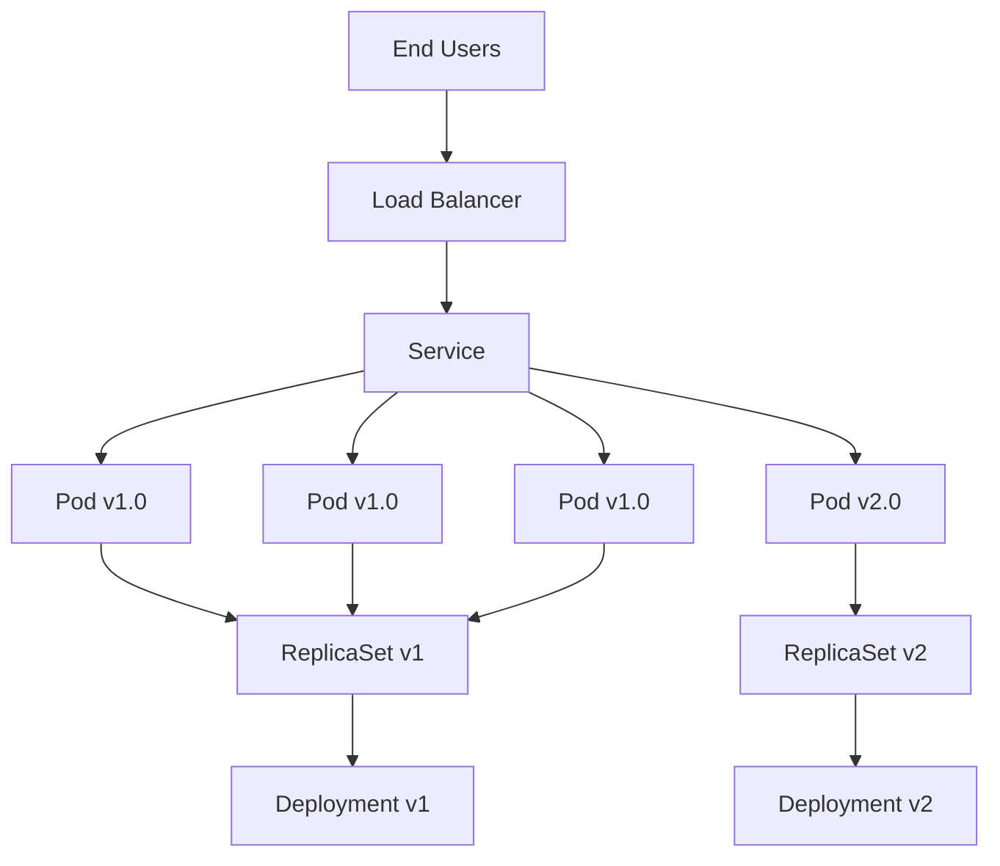

# 🚀 Complete Guide to Kubernetes Canary Deployments

> **Master the art of risk-free application deployments using native Kubernetes primitives**

## 📋 Table of Contents

1. [Introduction](#introduction)
2. [Core Concepts](#core-concepts)
3. [Architecture Overview](#architecture-overview)
4. [Deployment Strategies Comparison](#deployment-strategies-comparison)
5. [Implementation Strategy](#implementation-strategy)
6. [Traffic Management](#traffic-management)
7. [Monitoring and Observability](#monitoring-and-observability)
8. [Best Practices](#best-practices)
9. [Security Considerations](#security-considerations)
10. [Next Steps](#next-steps)

## 🎯 Introduction

Canary deployments are a sophisticated deployment strategy that allows you to gradually introduce new application versions while minimizing risk and maintaining system stability. Unlike traditional "big bang" deployments, canary deployments enable you to test new code with a small subset of users before full rollout.

### Why Canary Deployments?

- **🛡 Risk Mitigation**: Limit blast radius to a small percentage of users
- **📊 Real-world Testing**: Validate changes with actual production traffic
- **🔄 Easy Rollbacks**: Quick reversion if issues are detected
- **📈 Gradual Scaling**: Progressive confidence building
- **💰 Cost Effective**: Use existing infrastructure efficiently

## 🧠 Core Concepts

### Kubernetes Components



### Key Resources

1. **Deployment Controllers** - Manage application lifecycle
2. **ReplicaSets** - Maintain desired pod count
3. **Pods** - Run application containers
4. **Services** - Provide stable networking and load balancing
5. **Labels & Selectors** - Enable flexible traffic routing

### Label Strategy

Effective canary deployments rely on a dual-labeling approach:

```yaml
# Generic label (consistent across versions)
app-name: webapp

# Version-specific labels
app-version: v1.0     # for stable version
app-version: v2.0     # for canary version

# Environment and ownership
env: production
team: platform-engineering
```

## 🏗 Architecture Overview

### Traffic Flow

```
┌─────────────┐    ┌─────────────┐    ┌─────────────┐
│  End Users  │ -> │Load Balancer│ -> │   Service   │
└─────────────┘    └─────────────┘    └─────────────┘
                                              │
                                              v
┌─────────────────────────────────────────────────────────┐
│                Traffic Distribution                     │
│  ┌─────────────┐  ┌─────────────┐  ┌─────────────┐    │
│  │   Pod v1    │  │   Pod v1    │  │   Pod v2    │    │
│  │   (Stable)  │  │   (Stable)  │  │  (Canary)   │    │
│  └─────────────┘  └─────────────┘  └─────────────┘    │
└─────────────────────────────────────────────────────────┘
          67%              67%              33%
```

### Component Interaction

```yaml
# Service routes traffic based on labels
apiVersion: v1
kind: Service
spec:
  selector:
    app-name: webapp  # Routes to ALL pods with this label
```

```yaml
# Pods inherit labels from Deployment template
apiVersion: apps/v1
kind: Deployment
spec:
  template:
    metadata:
      labels:
        app-name: webapp    # Generic label
        app-version: v2.0   # Version-specific label
```

## ⚖️ Deployment Strategies Comparison

### Canary vs Blue-Green vs Rolling Update

| Feature | Canary | Blue-Green | Rolling Update |
|---------|--------|------------|----------------|
| **Traffic Distribution** | Gradual (5%→25%→50%→100%) | Instant (0%→100%) | Progressive replacement |
| **Resource Requirements** | Efficient | 2x resources | Current + small overhead |
| **Risk Level** | Low | Medium | Medium |
| **Rollback Speed** | Gradual | Instant | Medium |
| **Testing Period** | Extended | Limited | Limited |
| **Complexity** | Medium | Low | Low |
| **User Impact** | Minimal | None/All | Progressive |

### When to Use Canary Deployments

✅ **Ideal Scenarios**:
- Critical production applications
- Significant feature changes
- Database schema changes
- API modifications
- Performance optimizations

❌ **Not Recommended**:
- Emergency hotfixes
- Simple configuration changes
- Development/testing environments
- Resource-constrained environments

## 🎛 Implementation Strategy

### Phase 1: Preparation

```bash
# 1. Set up namespace
kubectl create namespace canary-demo

# 2. Configure image registry access
kubectl create secret docker-registry registry-secret \
  --docker-server=your-registry.com \
  --docker-username=username \
  --docker-password=password \
  --namespace=canary-demo

# 3. Verify cluster resources
kubectl top nodes
kubectl get storageclass
```

### Phase 2: Deploy Stable Version (v1)

```yaml
# v1-deployment.yaml
apiVersion: apps/v1
kind: Deployment
metadata:
  name: webapp-v1
  namespace: canary-demo
spec:
  replicas: 3
  selector:
    matchLabels:
      app-name: webapp
  template:
    metadata:
      labels:
        app-name: webapp
        app-version: v1.0
        deployment-type: stable
    spec:
      containers:
      - name: webapp
        image: your-registry/webapp:v1.0
        ports:
        - containerPort: 80
        resources:
          requests:
            memory: "64Mi"
            cpu: "100m"
          limits:
            memory: "128Mi"
            cpu: "200m"
        readinessProbe:
          httpGet:
            path: /health
            port: 80
          initialDelaySeconds: 5
          periodSeconds: 10
        livenessProbe:
          httpGet:
            path: /health
            port: 80
          initialDelaySeconds: 15
          periodSeconds: 20
```

### Phase 3: Service Configuration

```yaml
# service-initial.yaml
apiVersion: v1
kind: Service
metadata:
  name: webapp-service
  namespace: canary-demo
spec:
  type: LoadBalancer  # or ClusterIP for internal testing
  selector:
    app-version: v1.0  # Initially routes only to v1
  ports:
  - port: 80
    targetPort: 80
    name: http
```

### Phase 4: Deploy Canary Version (v2)

```yaml
# v2-deployment.yaml
apiVersion: apps/v1
kind: Deployment
metadata:
  name: webapp-v2
  namespace: canary-demo
spec:
  replicas: 1  # Start with minimal replicas
  selector:
    matchLabels:
      app-name: webapp
  template:
    metadata:
      labels:
        app-name: webapp
        app-version: v2.0
        deployment-type: canary
    spec:
      containers:
      - name: webapp
        image: your-registry/webapp:v2.0
        ports:
        - containerPort: 80
        resources:
          requests:
            memory: "64Mi"
            cpu: "100m"
          limits:
            memory: "128Mi"
            cpu: "200m"
        readinessProbe:
          httpGet:
            path: /health
            port: 80
          initialDelaySeconds: 5
          periodSeconds: 10
        livenessProbe:
          httpGet:
            path: /health
            port: 80
          initialDelaySeconds: 15
          periodSeconds: 20
```

## 🎯 Traffic Management

### Progressive Traffic Distribution

#### Step 1: 25% Canary Traffic
```yaml
# service-canary-25.yaml
apiVersion: v1
kind: Service
metadata:
  name: webapp-service
  namespace: canary-demo
spec:
  type: LoadBalancer
  selector:
    app-name: webapp  # Now routes to both v1 (3 pods) and v2 (1 pod)
  ports:
  - port: 80
    targetPort: 80
```

**Traffic Distribution**: 3 v1 pods + 1 v2 pod = 75% v1, 25% v2

#### Step 2: 50% Canary Traffic
```bash
# Scale up v2 to match v1
kubectl scale deployment webapp-v2 --replicas=3 -n canary-demo
```

**Traffic Distribution**: 3 v1 pods + 3 v2 pods = 50% v1, 50% v2

#### Step 3: 75% Canary Traffic
```bash
# Scale down v1
kubectl scale deployment webapp-v1 --replicas=1 -n canary-demo
```

**Traffic Distribution**: 1 v1 pod + 3 v2 pods = 25% v1, 75% v2

#### Step 4: 100% Canary Traffic
```yaml
# service-final.yaml
apiVersion: v1
kind: Service
metadata:
  name: webapp-service
  namespace: canary-demo
spec:
  type: LoadBalancer
  selector:
    app-version: v2.0  # Route only to v2
  ports:
  - port: 80
    targetPort: 80
```

### Advanced Traffic Splitting

For more precise control, consider using:

#### Ingress Controllers (NGINX)
```yaml
apiVersion: networking.k8s.io/v1
kind: Ingress
metadata:
  name: webapp-canary
  annotations:
    nginx.ingress.kubernetes.io/canary: "true"
    nginx.ingress.kubernetes.io/canary-weight: "20"
spec:
  rules:
  - host: webapp.example.com
    http:
      paths:
      - path: /
        pathType: Prefix
        backend:
          service:
            name: webapp-service-v2
            port:
              number: 80
```

#### Service Mesh (Istio)
```yaml
apiVersion: networking.istio.io/v1alpha3
kind: VirtualService
metadata:
  name: webapp-vs
spec:
  http:
  - route:
    - destination:
        host: webapp-service
        subset: v1
      weight: 80
    - destination:
        host: webapp-service
        subset: v2
      weight: 20
```

## 📊 Monitoring and Observability

### Essential Metrics

#### Application Metrics
```bash
# Response time
kubectl top pods -n canary-demo

# Error rates
kubectl logs -f deployment/webapp-v2 -n canary-demo

# Request count
curl -s http://webapp.example.com/metrics | grep request_count
```

#### Infrastructure Metrics
```bash
# Resource utilization
kubectl describe deployment webapp-v2 -n canary-demo

# Pod status
kubectl get pods -n canary-demo --show-labels

# Service endpoints
kubectl describe service webapp-service -n canary-demo
```

### Health Check Configuration

```yaml
# Enhanced health checks
readinessProbe:
  httpGet:
    path: /health/ready
    port: 8080
  initialDelaySeconds: 10
  periodSeconds: 5
  timeoutSeconds: 3
  successThreshold: 1
  failureThreshold: 3

livenessProbe:
  httpGet:
    path: /health/live
    port: 8080
  initialDelaySeconds: 30
  periodSeconds: 10
  timeoutSeconds: 5
  successThreshold: 1
  failureThreshold: 3

startupProbe:
  httpGet:
    path: /health/startup
    port: 8080
  initialDelaySeconds: 10
  periodSeconds: 10
  timeoutSeconds: 3
  successThreshold: 1
  failureThreshold: 30
```

### Monitoring Commands

```bash
# Real-time monitoring
watch kubectl get pods -n canary-demo

# Traffic testing
kubectl run client --image=busybox --rm -it -- sh
# Inside pod:
while true; do
  wget -qO- http://webapp-service.canary-demo.svc.cluster.local
  sleep 1
done

# Service endpoint monitoring
kubectl get endpoints webapp-service -n canary-demo -w

# Log aggregation
kubectl logs -l app-name=webapp -n canary-demo --tail=100 -f
```

## ✅ Best Practices

### 1. Gradual Rollout Strategy

```bash
# Recommended progression
# Phase 1: 5% (1 canary pod, 19 stable pods)
# Phase 2: 10% (2 canary pods, 18 stable pods)  
# Phase 3: 25% (5 canary pods, 15 stable pods)
# Phase 4: 50% (10 canary pods, 10 stable pods)
# Phase 5: 75% (15 canary pods, 5 stable pods)
# Phase 6: 100% (20 canary pods, 0 stable pods)
```

### 2. Automated Health Checks

```yaml
# Application-specific health endpoint
apiVersion: v1
kind: ConfigMap
metadata:
  name: webapp-config
data:
  health-check-config.yaml: |
    health:
      checks:
        - name: database
          type: postgres
          connection: postgres://...
        - name: redis
          type: redis
          connection: redis://...
        - name: external-api
          type: http
          url: https://api.external.com/health
```

### 3. Resource Management

```yaml
# Proper resource allocation
resources:
  requests:
    memory: "128Mi"
    cpu: "100m"
  limits:
    memory: "256Mi"
    cpu: "200m"

# Horizontal Pod Autoscaler
apiVersion: autoscaling/v2
kind: HorizontalPodAutoscaler
metadata:
  name: webapp-hpa
spec:
  scaleTargetRef:
    apiVersion: apps/v1
    kind: Deployment
    name: webapp-v2
  minReplicas: 2
  maxReplicas: 10
  metrics:
  - type: Resource
    resource:
      name: cpu
      target:
        type: Utilization
        averageUtilization: 70
  - type: Resource
    resource:
      name: memory
      target:
        type: Utilization
        averageUtilization: 80
```

### 4. Rollback Procedures

```bash
#!/bin/bash
# rollback.sh - Emergency rollback script

echo "🚨 Starting emergency rollback..."

# Immediate traffic cutover to stable version
kubectl patch service webapp-service -n canary-demo -p '{
  "spec": {
    "selector": {
      "app-version": "v1.0"
    }
  }
}'

# Scale up stable version if needed
kubectl scale deployment webapp-v1 --replicas=5 -n canary-demo

# Scale down canary version
kubectl scale deployment webapp-v2 --replicas=0 -n canary-demo

echo "✅ Rollback completed. Traffic routed to stable version."
```

## 🔒 Security Considerations

### 1. Image Security

```yaml
# Use signed images and security contexts
spec:
  template:
    spec:
      securityContext:
        runAsNonRoot: true
        runAsUser: 1000
        fsGroup: 2000
      containers:
      - name: webapp
        image: your-registry/webapp:v2.0@sha256:abc123...
        securityContext:
          allowPrivilegeEscalation: false
          readOnlyRootFilesystem: true
          capabilities:
            drop:
            - ALL
```

### 2. Network Policies

```yaml
apiVersion: networking.k8s.io/v1
kind: NetworkPolicy
metadata:
  name: webapp-network-policy
spec:
  podSelector:
    matchLabels:
      app-name: webapp
  policyTypes:
  - Ingress
  - Egress
  ingress:
  - from:
    - namespaceSelector:
        matchLabels:
          name: ingress-system
    ports:
    - protocol: TCP
      port: 80
  egress:
  - to:
    - namespaceSelector:
        matchLabels:
          name: database-system
    ports:
    - protocol: TCP
      port: 5432
```

### 3. RBAC Configuration

```yaml
apiVersion: rbac.authorization.k8s.io/v1
kind: Role
metadata:
  namespace: canary-demo
  name: canary-deployer
rules:
- apiGroups: ["apps"]
  resources: ["deployments", "replicasets"]
  verbs: ["get", "list", "watch", "create", "update", "patch", "delete"]
- apiGroups: [""]
  resources: ["services", "endpoints"]
  verbs: ["get", "list", "watch", "update", "patch"]
```

## 🎓 Next Steps

After mastering the basics, explore:

1. **[Practical Implementation](canary-practical-implementation.md)** - Hands-on tutorial
2. **[Advanced Strategies](canary-advanced-strategies.md)** - Service mesh and automation
3. **[Troubleshooting Guide](canary-troubleshooting.md)** - Common issues and solutions
4. **[YAML Examples](canary-yaml-examples.md)** - Production-ready manifests

---

**🚀 Ready for hands-on practice? Continue with the [Practical Implementation Guide](canary-practical-implementation.md)!**