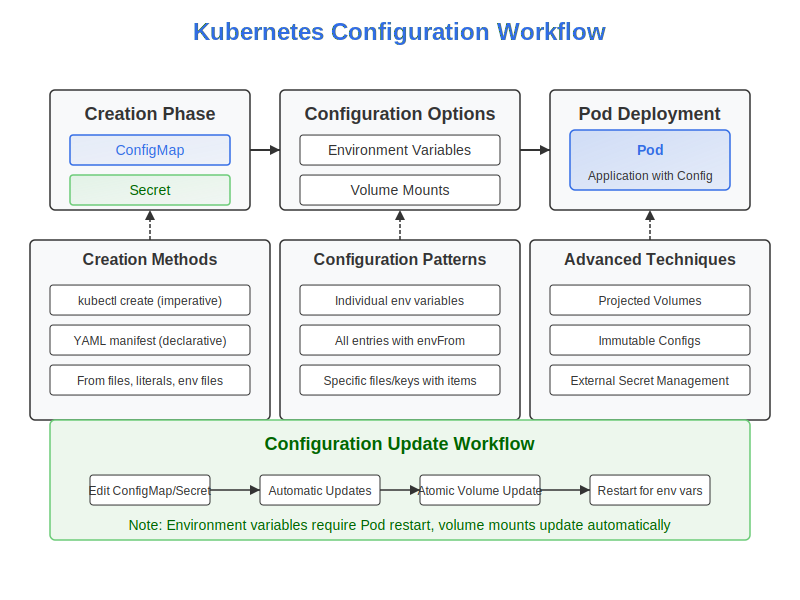

# Master ConfigMaps and Secrets Reference



This directory contains a consolidated collection of examples for ConfigMaps and Secrets in Kubernetes. Use these examples as a reference for your CKAD preparation or for quick implementation in your projects.

## Contents

- [ConfigMap Examples](#configmap-examples)
- [Secret Examples](#secret-examples)
- [Pod Configuration Examples](#pod-configuration-examples)
- [Advanced Configuration Examples](#advanced-configuration-examples)

## ConfigMap Examples

### Basic ConfigMap Creation

```yaml
# 01-basic-configmap.yaml
apiVersion: v1
kind: ConfigMap
metadata:
  name: app-config
data:
  app.environment: production
  log.level: info
  max.connections: "100"
```

### ConfigMap from Multi-line Text

```yaml
# 02-multiline-configmap.yaml
apiVersion: v1
kind: ConfigMap
metadata:
  name: nginx-config
data:
  nginx.conf: |
    server {
      listen 80;
      server_name example.com;
      
      location / {
        root /usr/share/nginx/html;
        index index.html;
      }
      
      location /api {
        proxy_pass http://backend-service;
        proxy_set_header Host $host;
        proxy_set_header X-Real-IP $remote_addr;
      }
    }
```

### Binary Data ConfigMap

```yaml
# 03-binary-configmap.yaml
apiVersion: v1
kind: ConfigMap
metadata:
  name: binary-config
binaryData:
  # Base64-encoded binary data
  sample.bin: SGVsbG8gV29ybGQhIFRoaXMgaXMgYSBiaW5hcnkgZmlsZSBleGFtcGxlLg==
```

### Immutable ConfigMap

```yaml
# 04-immutable-configmap.yaml
apiVersion: v1
kind: ConfigMap
metadata:
  name: immutable-config
data:
  app.environment: production
  log.level: info
immutable: true  # Makes this ConfigMap immutable
```

## Secret Examples

### Basic Secret

```yaml
# 05-basic-secret.yaml
apiVersion: v1
kind: Secret
metadata:
  name: db-credentials
type: Opaque
stringData:  # Use stringData for plaintext input
  username: admin
  password: S3cr3tP@ssw0rd
```

### TLS Secret

```yaml
# 06-tls-secret.yaml
apiVersion: v1
kind: Secret
metadata:
  name: tls-secret
type: kubernetes.io/tls
data:
  # Base64-encoded certificate and key
  tls.crt: LS0tLS1CRUdJTiBDRVJUSUZJQ0FURS0tLS0tCk1JSUVaRENDQTB5Z0F3SUJBZ0lVYUhFRWR6rlzLkVjNkpOWFd5ckw1MzD0tLS0tRU5EIENFUlRJRklDQVRFLS0tLS0K
  tls.key: LS0tLS1CRUdJTiBQUklWQVRFIEtFWS0tLS0tCk1JSUV2UUJDQUtDQVFFQXNVbk5OSW81eUFsrlzLzZXRYVlc3S28rL21CaWVCVHA0TlE0PSp0tLS0tRU5EIFBSSVZBVEUgS0VZLS0tLS0K
```

### Docker Registry Secret

```yaml
# 07-registry-secret.yaml
apiVersion: v1
kind: Secret
metadata:
  name: registry-credentials
type: kubernetes.io/dockerconfigjson
data:
  .dockerconfigjson: eyJhdXRocyI6eyJyZWdpc3RyeS5leGFtcGxlLmNvbSI6eyJ1c2VybmFtZSI6ImltYWdlLXB1bGxlciIsInBhc3N3b3JkIjoicDQkJHcwcmQiLCJlbWFpbCI6InB1bGxlckBleGFtcGxlLmNvbSIsImF1dGgiOiJhVzFoWjJVdGNIVnNiR1Z5T25BemRITmZkMjl5WkdRPSJ9fX0=
```

### Basic Auth Secret

```yaml
# 08-basic-auth-secret.yaml
apiVersion: v1
kind: Secret
metadata:
  name: api-basic-auth
type: kubernetes.io/basic-auth
stringData:
  username: api-user
  password: auth-password
```

### Immutable Secret

```yaml
# 09-immutable-secret.yaml
apiVersion: v1
kind: Secret
metadata:
  name: immutable-secret
type: Opaque
stringData:
  api-key: abcd1234
immutable: true  # Makes this Secret immutable
```

## Pod Configuration Examples

### Using ConfigMap as Environment Variables

```yaml
# 10-configmap-env-pod.yaml
apiVersion: v1
kind: Pod
metadata:
  name: configmap-env-pod
spec:
  containers:
  - name: app-container
    image: nginx:1.19
    env:
    - name: ENVIRONMENT
      valueFrom:
        configMapKeyRef:
          name: app-config
          key: app.environment
    - name: LOG_LEVEL
      valueFrom:
        configMapKeyRef:
          name: app-config
          key: log.level
          optional: true  # Optional field
```

### Using All ConfigMap Entries as Environment Variables

```yaml
# 11-configmap-envfrom-pod.yaml
apiVersion: v1
kind: Pod
metadata:
  name: configmap-envfrom-pod
spec:
  containers:
  - name: app-container
    image: nginx:1.19
    envFrom:
    - configMapRef:
        name: app-config
        optional: true
    - configMapRef:
        name: extra-config
        prefix: EXTRA_  # Adds prefix to all env vars from this ConfigMap
```

### Mounting ConfigMap as Volume

```yaml
# 12-configmap-volume-pod.yaml
apiVersion: v1
kind: Pod
metadata:
  name: configmap-volume-pod
spec:
  containers:
  - name: app-container
    image: nginx:1.19
    volumeMounts:
    - name: config-volume
      mountPath: /etc/config
  volumes:
  - name: config-volume
    configMap:
      name: nginx-config
```

### Mounting Specific ConfigMap Items

```yaml
# 13-configmap-items-pod.yaml
apiVersion: v1
kind: Pod
metadata:
  name: configmap-items-pod
spec:
  containers:
  - name: nginx
    image: nginx:1.19
    volumeMounts:
    - name: config-volume
      mountPath: /etc/nginx/conf.d
  volumes:
  - name: config-volume
    configMap:
      name: nginx-config
      items:
      - key: nginx.conf
        path: default.conf
```

### Using Secret as Environment Variables

```yaml
# 14-secret-env-pod.yaml
apiVersion: v1
kind: Pod
metadata:
  name: secret-env-pod
spec:
  containers:
  - name: app-container
    image: nginx:1.19
    env:
    - name: DB_USERNAME
      valueFrom:
        secretKeyRef:
          name: db-credentials
          key: username
    - name: DB_PASSWORD
      valueFrom:
        secretKeyRef:
          name: db-credentials
          key: password
```

### Using All Secret Entries as Environment Variables

```yaml
# 15-secret-envfrom-pod.yaml
apiVersion: v1
kind: Pod
metadata:
  name: secret-envfrom-pod
spec:
  containers:
  - name: app-container
    image: nginx:1.19
    envFrom:
    - secretRef:
        name: db-credentials
```

### Mounting Secret as Volume

```yaml
# 16-secret-volume-pod.yaml
apiVersion: v1
kind: Pod
metadata:
  name: secret-volume-pod
spec:
  containers:
  - name: app-container
    image: nginx:1.19
    volumeMounts:
    - name: secret-volume
      mountPath: /etc/certs
      readOnly: true  # Best practice for secrets
  volumes:
  - name: secret-volume
    secret:
      secretName: tls-secret
      defaultMode: 0400  # Read-only for owner
```

### Using Docker Registry Secret

```yaml
# 17-registry-secret-pod.yaml
apiVersion: v1
kind: Pod
metadata:
  name: private-image-pod
spec:
  containers:
  - name: private-app
    image: registry.example.com/my-app:1.0
  imagePullSecrets:
  - name: registry-credentials
```

## Advanced Configuration Examples

### Projected Volume with Multiple Sources

```yaml
# 18-projected-volume-pod.yaml
apiVersion: v1
kind: Pod
metadata:
  name: projected-volume-pod
spec:
  containers:
  - name: app-container
    image: nginx:1.19
    volumeMounts:
    - name: projected-config
      mountPath: /etc/projected
      readOnly: true
  volumes:
  - name: projected-config
    projected:
      sources:
      - configMap:
          name: app-config
      - secret:
          name: db-credentials
          items:
          - key: username
            path: db/username
            mode: 0400
          - key: password
            path: db/password
            mode: 0400
      - downwardAPI:
          items:
          - path: "pod-name"
            fieldRef:
              fieldPath: metadata.name
```

### Pod with Downward API Environment Variables

```yaml
# 19-downwardapi-env-pod.yaml
apiVersion: v1
kind: Pod
metadata:
  name: downwardapi-env-pod
  labels:
    app: web
spec:
  containers:
  - name: app-container
    image: nginx:1.19
    env:
    - name: POD_NAME
      valueFrom:
        fieldRef:
          fieldPath: metadata.name
    - name: POD_NAMESPACE
      valueFrom:
        fieldRef:
          fieldPath: metadata.namespace
    - name: POD_IP
      valueFrom:
        fieldRef:
          fieldPath: status.podIP
    - name: NODE_NAME
      valueFrom:
        fieldRef:
          fieldPath: spec.nodeName
    - name: CPU_LIMIT
      valueFrom:
        resourceFieldRef:
          containerName: app-container
          resource: limits.cpu
```

### Deployment with ConfigMap Reference

```yaml
# 20-deployment-with-config.yaml
apiVersion: apps/v1
kind: Deployment
metadata:
  name: web-deployment
spec:
  replicas: 3
  selector:
    matchLabels:
      app: web
  template:
    metadata:
      labels:
        app: web
    spec:
      containers:
      - name: web
        image: nginx:1.19
        ports:
        - containerPort: 80
        envFrom:
        - configMapRef:
            name: app-config
        volumeMounts:
        - name: config-volume
          mountPath: /etc/nginx/conf.d
      volumes:
      - name: config-volume
        configMap:
          name: nginx-config
          items:
          - key: nginx.conf
            path: default.conf
```

## Command-Line Examples

Here are common imperative commands for working with ConfigMaps and Secrets:

### ConfigMap Commands

```bash
# Create ConfigMap from literals
kubectl create configmap app-config \
  --from-literal=app.environment=production \
  --from-literal=log.level=info

# Create ConfigMap from file
kubectl create configmap nginx-config \
  --from-file=nginx.conf

# Create ConfigMap from directory
kubectl create configmap app-configs \
  --from-file=config-files/

# Create ConfigMap from env file
kubectl create configmap env-config \
  --from-env-file=.env

# View ConfigMap
kubectl get configmap app-config -o yaml

# Edit ConfigMap
kubectl edit configmap app-config
```

### Secret Commands

```bash
# Create Secret from literals
kubectl create secret generic db-credentials \
  --from-literal=username=admin \
  --from-literal=password=secret

# Create TLS Secret
kubectl create secret tls tls-secret \
  --cert=path/to/cert.crt \
  --key=path/to/key.key

# Create Docker registry Secret
kubectl create secret docker-registry registry-credentials \
  --docker-server=registry.example.com \
  --docker-username=username \
  --docker-password=password \
  --docker-email=email@example.com

# View Secret (base64-encoded)
kubectl get secret db-credentials -o yaml

# Decode Secret value
kubectl get secret db-credentials -o jsonpath='{.data.password}' | base64 --decode
```

## CKAD Exam Tips

When preparing for the CKAD exam, keep these tips in mind:

1. **Know the Imperative Commands**: Being able to quickly create ConfigMaps and Secrets with `kubectl create` commands is essential for time management.

2. **Understand Different Usage Patterns**: Be comfortable with both environment variables and volume mounts.

3. **Practice Troubleshooting**: Be able to identify and fix common issues with ConfigMaps and Secrets, such as missing references or incorrect mounting.

4. **Focus on Security Best Practices**: Remember to use `readOnly: true` for Secret volumes and set appropriate file permissions.

5. **Understand Update Behavior**: Know when configuration changes require Pod restarts (env vars) versus when they update automatically (volume mounts).

These examples cover most of the ConfigMap and Secret scenarios you'll encounter in the CKAD exam. Make sure to practice applying them in different combinations.
