# Kubernetes PriorityClass Master Guide

## Table of Contents
- [Introduction](#introduction)
- [What is PriorityClass?](#what-is-priorityclass)
- [How PriorityClass Works](#how-priorityclass-works)
- [Creating PriorityClass Resources](#creating-priorityclass-resources)
- [Using PriorityClass in Pods](#using-priorityclass-in-pods)
- [Built-in Priority Classes](#built-in-priority-classes)
- [Preemption Behavior](#preemption-behavior)
- [Best Practices](#best-practices)
- [Real-World Scenarios](#real-world-scenarios)
- [YAML Examples](#yaml-examples)
- [Troubleshooting](#troubleshooting)
- [CKAD Exam Tips](#ckad-exam-tips)

## Introduction

PriorityClass is a crucial Kubernetes feature that enables workload prioritization and resource scheduling optimization. This guide provides comprehensive coverage for DevOps and Platform Engineers working with Kubernetes, especially those preparing for CKAD certification.

### PriorityClass Overview Architecture

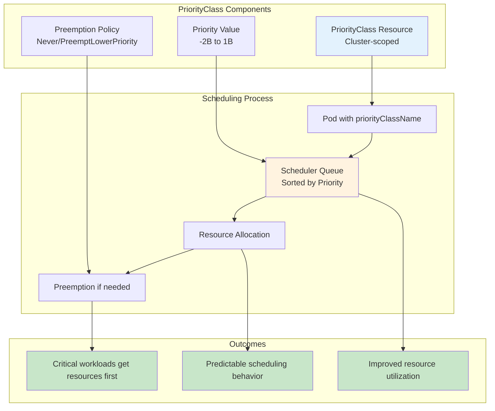

## What is PriorityClass?

**PriorityClass** is a non-namespaced Kubernetes resource that defines a mapping between a priority class name and the priority integer value. It allows you to assign different priority levels to pods, influencing:

- **Scheduling Order**: Higher priority pods are scheduled before lower priority ones
- **Resource Allocation**: Critical workloads get preference during resource contention
- **Preemption**: Higher priority pods can evict lower priority pods when resources are scarce

### Key Benefits
- Ensures critical applications get resources first
- Improves cluster resource utilization
- Provides predictable scheduling behavior
- Enables workload segregation by importance

## How PriorityClass Works

### Priority Values Hierarchy

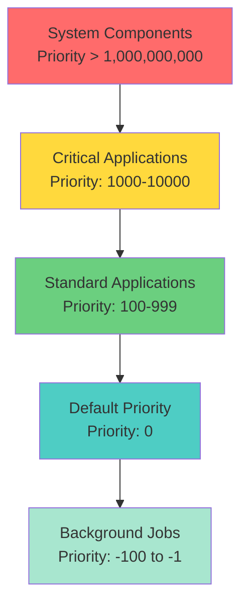

### Priority Values
- **Range**: -2,147,483,648 to 1,000,000,000
- **Higher values = Higher priority**
- **Default**: Pods without PriorityClass have priority 0
- **System Reserved**: Values > 1,000,000,000 reserved for system components

### Scheduling Flow

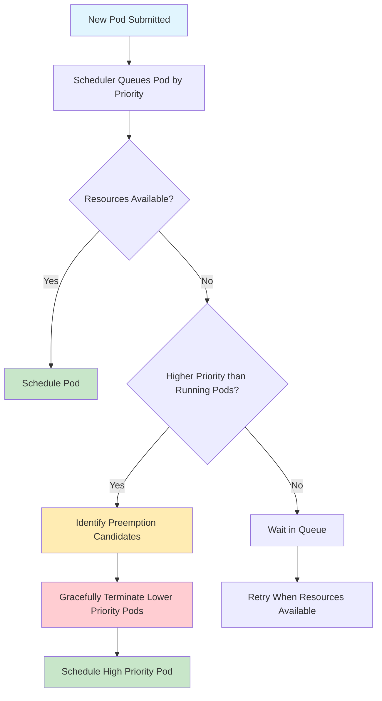

### Kubernetes Architecture with PriorityClass

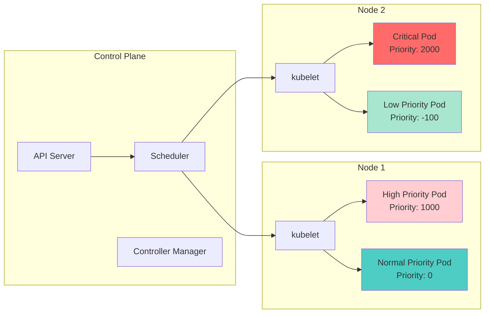

## Creating PriorityClass Resources

### Basic PriorityClass Structure

```yaml
apiVersion: scheduling.k8s.io/v1
kind: PriorityClass
metadata:
  name: high-priority
value: 1000
globalDefault: false
description: "High priority class for critical applications"
```

### Key Fields Explained

| Field | Description | Required |
|-------|-------------|----------|
| `value` | Priority integer (-2147483648 to 1000000000) | Yes |
| `globalDefault` | Makes this the default for pods without priorityClassName | No |
| `description` | Human-readable description | No |
| `preemptionPolicy` | Controls preemption behavior (Never/PreemptLowerPriority) | No |

## Using PriorityClass in Pods

### Pod Specification

```yaml
apiVersion: v1
kind: Pod
metadata:
  name: critical-app
spec:
  priorityClassName: high-priority
  containers:
  - name: app
    image: nginx:1.21
    resources:
      requests:
        memory: "256Mi"
        cpu: "250m"
      limits:
        memory: "512Mi"
        cpu: "500m"
```

### Deployment with PriorityClass

```yaml
apiVersion: apps/v1
kind: Deployment
metadata:
  name: critical-deployment
spec:
  replicas: 3
  selector:
    matchLabels:
      app: critical-app
  template:
    metadata:
      labels:
        app: critical-app
    spec:
      priorityClassName: high-priority
      containers:
      - name: app
        image: nginx:1.21
```

## Built-in Priority Classes

Kubernetes provides several system priority classes:

### System Priority Classes

```bash
# View system priority classes
kubectl get priorityclasses

# Common system classes:
# - system-cluster-critical (2000000000)
# - system-node-critical (2000001000)
```

### Viewing Priority Classes

```bash
# List all priority classes
kubectl get pc

# Describe specific priority class
kubectl describe priorityclass high-priority

# Get priority class YAML
kubectl get priorityclass high-priority -o yaml
```

## Preemption Behavior

### Preemption Decision Flow

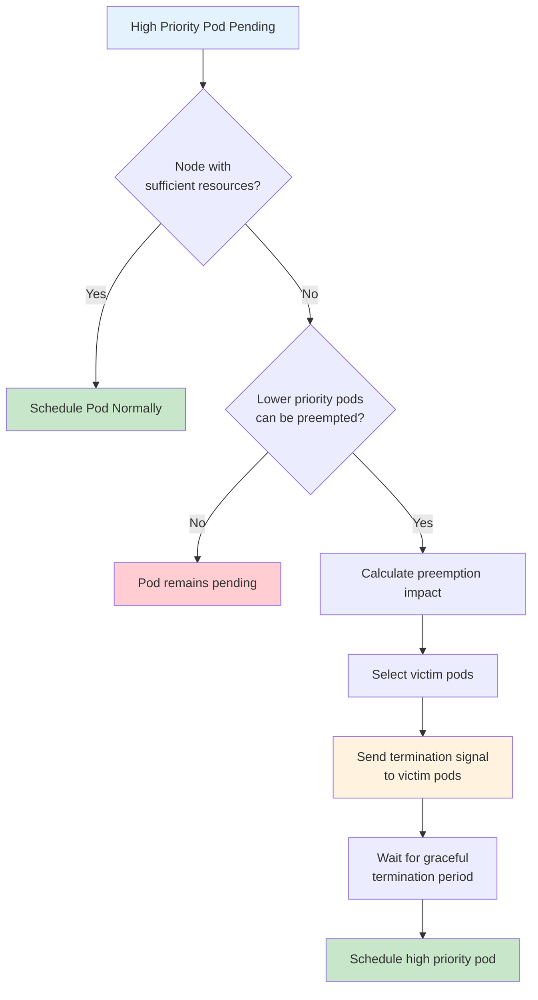

### Preemption Scenario Visualization

```
Before Preemption:
┌─────────────────────────────────────────────────┐
│ Node A (8GB RAM, 4 CPU cores)                  │
├─────────────────────────────────────────────────┤
│ Pod-1 (Priority: 100) │ Pod-2 (Priority: 200) │
│ 2GB RAM, 1 CPU        │ 3GB RAM, 1.5 CPU      │
├─────────────────────────────────────────────────┤
│ Pod-3 (Priority: 50)  │ Available: 1GB, 0.5   │
│ 2GB RAM, 1 CPU        │ CPU (insufficient)     │
└─────────────────────────────────────────────────┘

High Priority Pod (Priority: 1000) needs: 3GB RAM, 2 CPU

After Preemption:
┌─────────────────────────────────────────────────┐
│ Node A (8GB RAM, 4 CPU cores)                  │
├─────────────────────────────────────────────────┤
│ High-Priority Pod     │ Pod-2 (Priority: 200) │
│ 3GB RAM, 2 CPU        │ 3GB RAM, 1.5 CPU      │
├─────────────────────────────────────────────────┤
│ Available: 2GB, 0.5   │ Pod-1 & Pod-3         │
│ CPU                   │ PREEMPTED             │
└─────────────────────────────────────────────────┘
```

### When Preemption Occurs
- No suitable node has enough resources for high-priority pod
- Lower priority pods exist on nodes that could accommodate the high-priority pod
- Preemption would make scheduling the high-priority pod possible

### Preemption Process
1. Scheduler identifies victim pods (lower priority)
2. Victim pods receive graceful termination signal
3. Scheduler waits for graceful termination period
4. High-priority pod gets scheduled on freed resources

### Controlling Preemption

```yaml
apiVersion: scheduling.k8s.io/v1
kind: PriorityClass
metadata:
  name: no-preempt-priority
value: 500
preemptionPolicy: Never  # Disables preemption
description: "Priority class that won't preempt other pods"
```

## Best Practices

### 1. Priority Value Strategy

```yaml
# Production-grade priority hierarchy
---
apiVersion: scheduling.k8s.io/v1
kind: PriorityClass
metadata:
  name: critical-priority
value: 1000
description: "For business-critical applications"
---
apiVersion: scheduling.k8s.io/v1
kind: PriorityClass
metadata:
  name: high-priority
value: 500
description: "For important production workloads"
---
apiVersion: scheduling.k8s.io/v1
kind: PriorityClass
metadata:
  name: normal-priority
value: 100
globalDefault: true
description: "Default priority for standard workloads"
---
apiVersion: scheduling.k8s.io/v1
kind: PriorityClass
metadata:
  name: low-priority
value: -100
description: "For batch jobs and non-critical workloads"
```

### 2. Resource Requests Are Essential

```yaml
# Always specify resource requests with priority classes
spec:
  priorityClassName: high-priority
  containers:
  - name: app
    image: myapp:v1.0
    resources:
      requests:        # Required for effective scheduling
        memory: "512Mi"
        cpu: "500m"
      limits:
        memory: "1Gi"
        cpu: "1000m"
```

### 3. Avoid Too Many Priority Levels
- Use 3-5 distinct priority levels maximum
- More levels create complexity without significant benefit
- Focus on clear business-driven categories

### 4. Monitor and Alert
```bash
# Monitor pod preemption events
kubectl get events --field-selector=reason=Preempted

# Check pod priority and status
kubectl get pods -o custom-columns=NAME:.metadata.name,PRIORITY:.spec.priority,STATUS:.status.phase
```

## Real-World Scenarios

### Scenario 1: E-commerce Platform Architecture

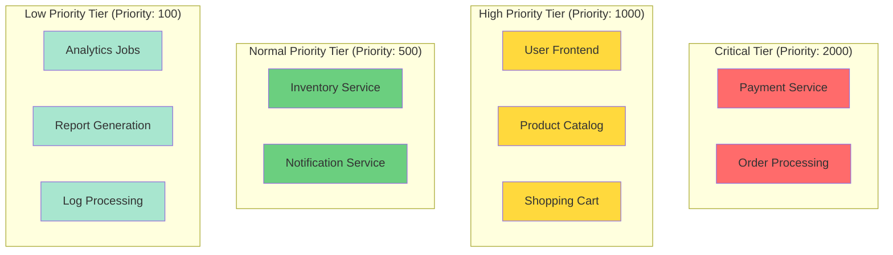

```yaml
# Payment service - highest priority
apiVersion: scheduling.k8s.io/v1
kind: PriorityClass
metadata:
  name: payment-critical
value: 2000
description: "Payment processing - business critical"
---
# Frontend - high priority
apiVersion: scheduling.k8s.io/v1
kind: PriorityClass
metadata:
  name: frontend-high
value: 1000
description: "Customer-facing applications"
---
# Analytics - low priority
apiVersion: scheduling.k8s.io/v1
kind: PriorityClass
metadata:
  name: analytics-low
value: 100
description: "Analytics and reporting jobs"
```

### Scenario 2: Multi-tenant Platform

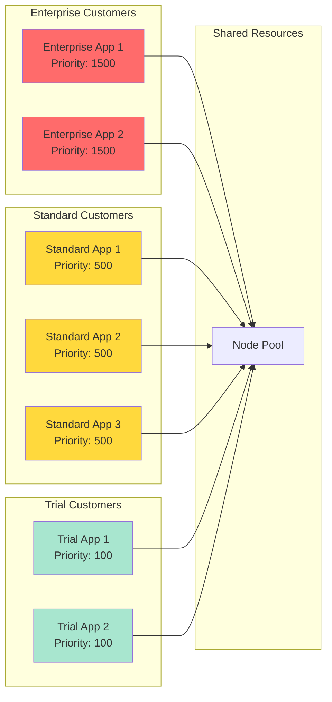

```yaml
# Tenant isolation with priorities
---
apiVersion: scheduling.k8s.io/v1
kind: PriorityClass
metadata:
  name: enterprise-tier
value: 1500
description: "Enterprise customer workloads"
---
apiVersion: scheduling.k8s.io/v1
kind: PriorityClass
metadata:
  name: standard-tier
value: 500
description: "Standard customer workloads"
---
apiVersion: scheduling.k8s.io/v1
kind: PriorityClass
metadata:
  name: trial-tier
value: 100
description: "Trial customer workloads"
```

### Scenario 3: CI/CD Pipeline Priority Management

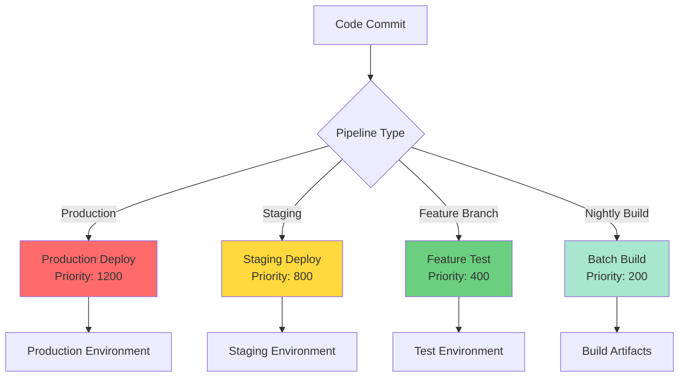

```yaml
# Production deployments
apiVersion: scheduling.k8s.io/v1
kind: PriorityClass
metadata:
  name: production-deploy
value: 1200
description: "Production deployment pipelines"
---
# Testing workloads
apiVersion: scheduling.k8s.io/v1
kind: PriorityClass
metadata:
  name: test-workload
value: 200
preemptionPolicy: Never  # Don't disrupt other workloads
description: "Test and QA workloads"
```

## YAML Examples

### Complete Application Stack with Priorities

```yaml
# Database - Critical
apiVersion: apps/v1
kind: StatefulSet
metadata:
  name: database
spec:
  serviceName: db-service
  replicas: 3
  selector:
    matchLabels:
      app: database
  template:
    metadata:
      labels:
        app: database
    spec:
      priorityClassName: critical-priority
      containers:
      - name: postgres
        image: postgres:13
        resources:
          requests:
            memory: "1Gi"
            cpu: "500m"
          limits:
            memory: "2Gi"
            cpu: "1000m"
---
# API Server - High Priority
apiVersion: apps/v1
kind: Deployment
metadata:
  name: api-server
spec:
  replicas: 5
  selector:
    matchLabels:
      app: api-server
  template:
    metadata:
      labels:
        app: api-server
    spec:
      priorityClassName: high-priority
      containers:
      - name: api
        image: api-server:v2.1
        resources:
          requests:
            memory: "512Mi"
            cpu: "250m"
---
# Background Jobs - Low Priority
apiVersion: batch/v1
kind: CronJob
metadata:
  name: cleanup-job
spec:
  schedule: "0 2 * * *"
  jobTemplate:
    spec:
      template:
        spec:
          priorityClassName: low-priority
          containers:
          - name: cleanup
            image: cleanup-tool:latest
            resources:
              requests:
                memory: "256Mi"
                cpu: "100m"
          restartPolicy: OnFailure
```

### Priority Class with Pod Disruption Budget

```yaml
# High priority deployment
apiVersion: apps/v1
kind: Deployment
metadata:
  name: critical-service
spec:
  replicas: 3
  selector:
    matchLabels:
      app: critical-service
  template:
    metadata:
      labels:
        app: critical-service
    spec:
      priorityClassName: critical-priority
      containers:
      - name: service
        image: critical-service:v1.0
---
# Protect against excessive preemption
apiVersion: policy/v1
kind: PodDisruptionBudget
metadata:
  name: critical-service-pdb
spec:
  minAvailable: 2
  selector:
    matchLabels:
      app: critical-service
```

## Troubleshooting

### Troubleshooting Decision Tree

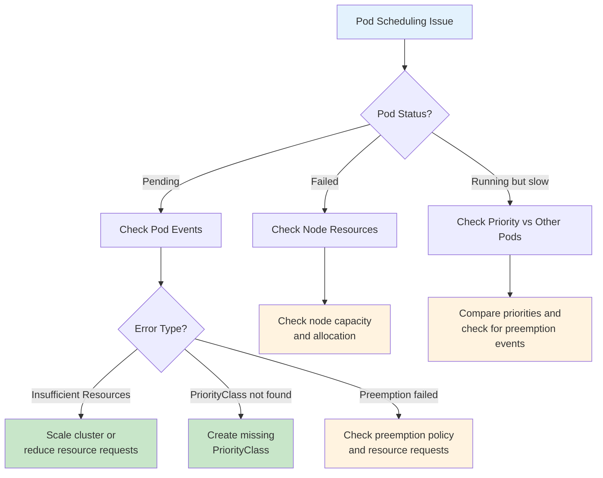

### Common Issues and Solutions

#### 1. Pod Priority Hierarchy Visualization

```
Current Cluster State:
┌─────────────────────────────────────────────────────────────┐
│ Priority Queue (Scheduler View)                            │
├─────────────────────────────────────────────────────────────┤
│ 🔴 Critical Pod     (Priority: 2000) - ✅ Scheduled        │
│ 🟡 High Priority    (Priority: 1000) - ⏳ Pending          │
│ 🟢 Normal Priority  (Priority: 500)  - ✅ Running          │
│ 🔵 Low Priority     (Priority: 100)  - ⚠️ Preempted        │
│ 🟣 Batch Job        (Priority: -100) - ⏳ Waiting          │
└─────────────────────────────────────────────────────────────┘

Legend:
✅ Scheduled/Running  ⏳ Pending/Waiting  ⚠️ Preempted  🔴 Critical  🟡 High  🟢 Normal  🔵 Low  🟣 Batch
```

#### 1. Pods Stuck in Pending State

```bash
# Check pod events
kubectl describe pod <pod-name>

# Look for:
# - Insufficient resources
# - Preemption failures
# - Node selector issues
```

**Solution**: Verify resource requests and cluster capacity

#### 2. Unexpected Preemption

```bash
# Check preemption events
kubectl get events --field-selector=reason=Preempted

# Verify priority class values
kubectl get priorityclasses -o custom-columns=NAME:.metadata.name,VALUE:.value
```

**Solution**: Review priority hierarchy and resource allocations

#### 3. Priority Class Not Found

```bash
# Error: PriorityClass "missing-priority" not found

# List available priority classes
kubectl get pc

# Check pod specification
kubectl get pod <pod-name> -o yaml | grep -A 5 -B 5 priority
```

**Solution**: Create missing PriorityClass or correct pod specification

### Resource Allocation Analysis

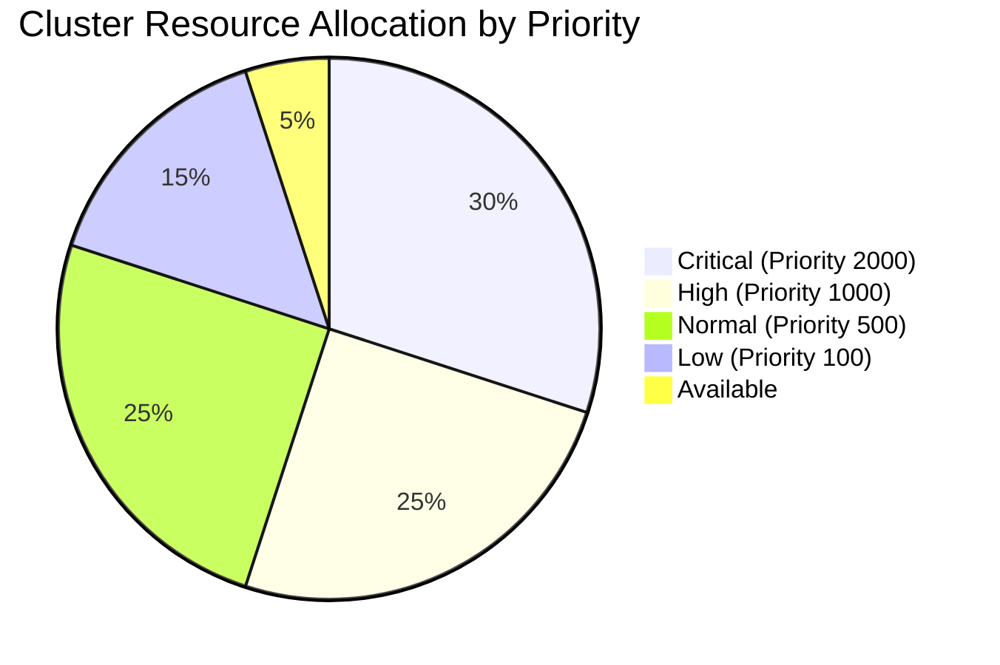

### Debugging Commands

```bash
# View pod priority and scheduling
kubectl get pods -o custom-columns=NAME:.metadata.name,PRIORITY:.spec.priority,NODE:.spec.nodeName,STATUS:.status.phase

# Check scheduler logs
kubectl logs -n kube-system -l component=kube-scheduler

# Monitor resource usage
kubectl top nodes
kubectl top pods

# View cluster events
kubectl get events --sort-by='.lastTimestamp' | tail -20
```

### Node Resource Visualization

```
Node Resource Status:
┌─────────────────────────────────────────────────────────────────┐
│ Node: worker-1                                                  │
├─────────────────────────────────────────────────────────────────┤
│ CPU:    [████████████████████████████████████████████████████] │
│         12/16 cores (75% used)                                  │
│                                                                 │
│ Memory: [████████████████████████████████████████████████████] │
│         28/32 GB (87.5% used)                                   │
│                                                                 │
│ Running Pods by Priority:                                       │
│ 🔴 Critical: 2 pods (8 cores, 16GB)                           │
│ 🟡 High:     1 pod  (2 cores, 4GB)                            │
│ 🟢 Normal:   3 pods (2 cores, 8GB)                            │
└─────────────────────────────────────────────────────────────────┘
```

### Validation Script

```bash
#!/bin/bash
# validate-priorities.sh

echo "=== Priority Class Validation ==="

# Check if priority classes exist
echo "Available Priority Classes:"
kubectl get priorityclasses -o custom-columns=NAME:.metadata.name,VALUE:.value,DEFAULT:.globalDefault

echo -e "\n=== Pods with Priority Classes ==="
kubectl get pods --all-namespaces -o custom-columns=NAMESPACE:.metadata.namespace,NAME:.metadata.name,PRIORITY-CLASS:.spec.priorityClassName,PRIORITY-VALUE:.spec.priority,STATUS:.status.phase

echo -e "\n=== Recent Preemption Events ==="
kubectl get events --all-namespaces --field-selector=reason=Preempted --sort-by='.lastTimestamp' | tail -10
```

## CKAD Exam Tips

### CKAD PriorityClass Knowledge Map

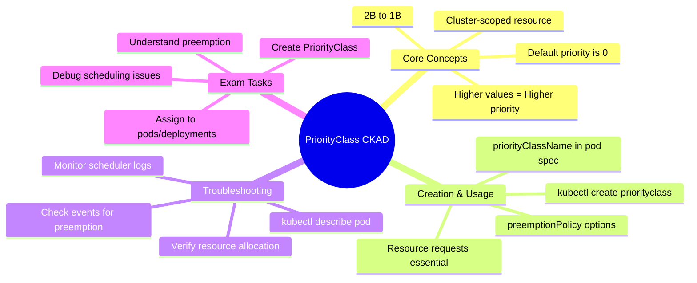

### Key Concepts to Remember

```
┌─────────────────────────────────────────────────────────────────┐
│                    CKAD Priority Concepts                       │
├─────────────────────────────────────────────────────────────────┤
│ ✅ PriorityClass is cluster-scoped (not namespaced)             │
│ ✅ Higher values = Higher priority                              │
│ ✅ Default priority is 0 for pods without priorityClassName     │
│ ✅ Resource requests are crucial for effective prioritization   │
│ ✅ Preemption can be disabled with preemptionPolicy: Never     │
│ ✅ System components use priority > 1,000,000,000              │
├─────────────────────────────────────────────────────────────────┤
│ ⚠️  Common Exam Pitfalls:                                       │
│ • Forgetting resource requests                                  │
│ • Using namespaced kubectl commands                             │
│ • Mixing up priority values (higher = more important)          │
│ • Not understanding preemption behavior                         │
└─────────────────────────────────────────────────────────────────┘
```

### Common CKAD Tasks

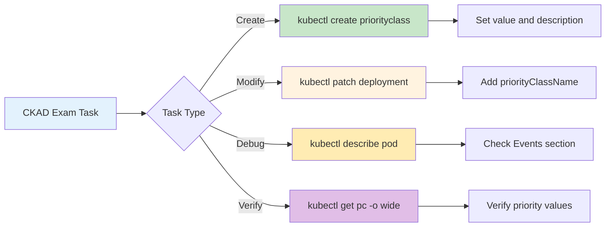

### Practice Commands

```bash
# Create priority class quickly
kubectl create priorityclass high-priority --value=1000 --description="High priority workloads"

# Apply priority to existing deployment
kubectl patch deployment myapp -p '{"spec":{"template":{"spec":{"priorityClassName":"high-priority"}}}}'

# Check pod priority
kubectl get pod mypod -o jsonpath='{.spec.priority}'

# Describe scheduling events
kubectl describe pod mypod | grep -A 10 Events
```

### CKAD Exam Time Management

```
Exam Strategy for PriorityClass Questions:
┌─────────────────────────────────────────────────────────────────┐
│ Time Allocation (Total: 5-10 minutes typical)                  │
├─────────────────────────────────────────────────────────────────┤
│ 📝 Read question carefully                          (1 min)     │
│ 🔧 Create PriorityClass resource                    (2 min)     │
│ 🚀 Create/modify pod with priorityClassName         (2 min)     │
│ ✅ Verify configuration and test                    (2 min)     │
│ 📋 Document any additional requirements             (1 min)     │
├─────────────────────────────────────────────────────────────────┤
│ 💡 Pro Tips:                                                    │
│ • Use --dry-run=client -o yaml for templates                   │
│ • Always specify resource requests                              │
│ • Double-check priority values (higher = more important)       │
│ • Test with kubectl describe pod to verify                     │
└─────────────────────────────────────────────────────────────────┘
```

### Sample CKAD Question Format

**Question**: Create a PriorityClass named `mission-critical` with value 2000 and description "Mission critical applications". Then create a pod named `critical-pod` using image `nginx:1.21` with this priority class and resource requests of 256Mi memory and 250m CPU.

**Solution**:
```bash
# Create PriorityClass
kubectl create priorityclass mission-critical --value=2000 --description="Mission critical applications"

# Create pod with priority class
kubectl run critical-pod --image=nginx:1.21 --dry-run=client -o yaml > critical-pod.yaml

# Edit to add priorityClassName and resources
vim critical-pod.yaml

# Apply the configuration
kubectl apply -f critical-pod.yaml
```

## Conclusion

PriorityClass is essential for production Kubernetes environments where workload prioritization directly impacts business outcomes. Proper implementation ensures critical applications receive necessary resources while maintaining efficient cluster utilization.

### PriorityClass Implementation Roadmap

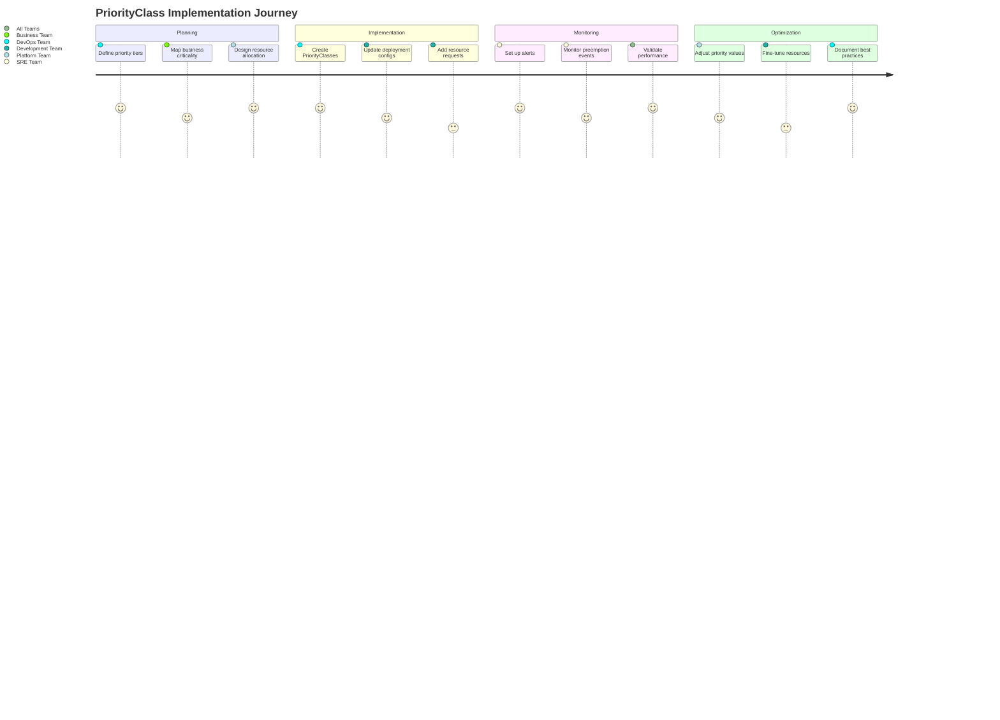

### Quick Reference Summary

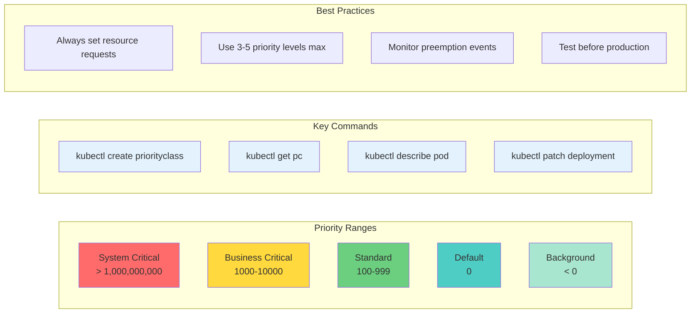

### Key Takeaways
- Use clear, business-aligned priority hierarchies
- Always specify resource requests with priority classes  
- Monitor preemption events and cluster resource usage
- Implement proper testing before production deployment
- Consider Pod Disruption Budgets with high-priority workloads

### Additional Resources
- [Kubernetes Pod Priority and Preemption Documentation](https://kubernetes.io/docs/concepts/scheduling-eviction/pod-priority-preemption/)
- [CKAD Curriculum](https://github.com/cncf/curriculum)
- [Kubernetes Scheduler Configuration](https://kubernetes.io/docs/reference/scheduling/)

---

**Author**: DevOps/Platform Engineering Content Creator  
**Last Updated**: May 2025  
**Version**: 1.0
