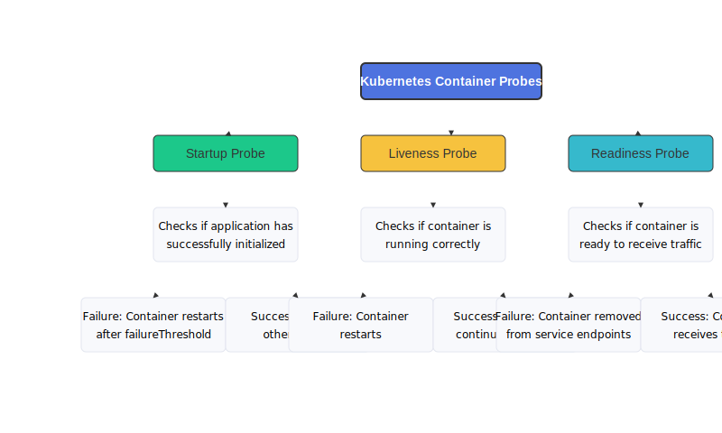
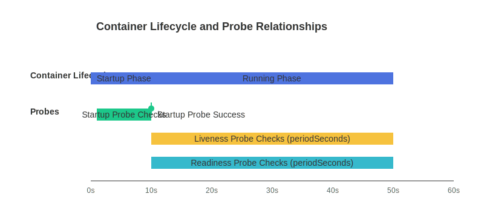
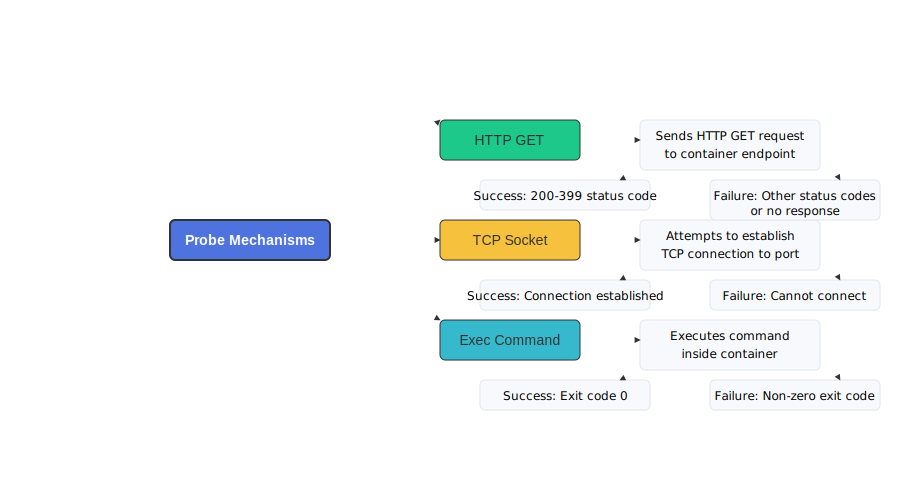

# Kubernetes Container Health Checks Master Guide

## Overview
Container health probes are essential mechanisms in Kubernetes that monitor the health status of your containers within pods. They enable Kubernetes to make intelligent decisions about container lifecycle management, including restarting unhealthy containers and managing traffic routing.



## Why Health Probes Matter

Health probes provide critical benefits for application reliability:

- **Automatic recovery**: Detect and restart unhealthy containers
- **Traffic management**: Route traffic only to healthy containers
- **Graceful deployment**: Coordinate startup and shutdown sequences
- **Self-healing**: Enable applications to recover from transient failures

## Types of Health Probes

Kubernetes offers three distinct types of probes that serve different purposes in the application lifecycle.

### 1. Startup Probes

**Purpose**: Determine when a container application has successfully initialized.

**When it runs**: During the initialization phase only, before other probes.

**Key characteristics**:
- Used to detect when an application has completed its startup sequence
- Particularly useful for applications with lengthy startup processes
- Other probes are disabled until the startup probe succeeds
- Gives slow-starting containers time to initialize before liveness checks begin

**Behavior on failure**: If a startup probe fails for the configured number of attempts, the container is terminated and subject to the pod's restart policy.

### 2. Liveness Probes

**Purpose**: Detect if a container is running properly throughout its lifecycle.

**When it runs**: Periodically throughout the container's lifecycle, after startup.

**Key characteristics**:
- Identifies containers that are running but in an unhealthy state
- If a liveness probe fails, Kubernetes will restart the container
- Helps recover from deadlocks and other runtime issues
- Ensures containers that have crashed internally are restarted

**Behavior on failure**: Container is terminated and restarted according to the pod's restart policy.

### 3. Readiness Probes

**Purpose**: Determine if a container is ready to accept traffic or requests.

**When it runs**: Throughout the container's lifecycle, in parallel with liveness probes.

**Key characteristics**:
- Identifies when a container is temporarily not able to serve requests
- If a readiness probe fails, the container is removed from service load balancers
- Does NOT cause container restarts, only affects service traffic routing
- Useful for graceful maintenance, rolling deployments, and handling temporary unavailability

**Behavior on failure**: Container is marked as not ready and removed from service endpoints.



## Probe Implementation Methods

Each probe type can be implemented using one of three methods:



### 1. HTTP GET Probes

**Description**: Performs an HTTP GET request against a specified path and port in the container.

**How it works**:
- The kubelet sends an HTTP GET request to the specified endpoint
- Status codes between 200-399 indicate success
- Any other status code or no response indicates failure

**Example**:
```yaml
livenessProbe:
  httpGet:
    path: /healthz
    port: 8080
  initialDelaySeconds: 15
  periodSeconds: 10
```

**Best suited for**:
- Web applications and APIs with health check endpoints
- Applications that can expose HTTP-based status information
- Services that operate at the application layer (Layer 7)

### 2. TCP Socket Probes

**Description**: Attempts to establish a TCP connection to a specified port.

**How it works**:
- The kubelet attempts to open a TCP connection to the container on the specified port
- If the connection can be established, the probe is considered successful
- If the connection cannot be established, the probe fails

**Example**:
```yaml
startupProbe:
  tcpSocket:
    port: 3306
  failureThreshold: 30
  periodSeconds: 10
```

**Best suited for**:
- Database services like MySQL, PostgreSQL
- Applications where basic network connectivity verification is sufficient
- Services that operate at the transport layer (Layer 4)
- Quick checking if a service is accepting connections

### 3. Exec Probes

**Description**: Executes a specified command inside the container.

**How it works**:
- The kubelet runs the command in the container's environment
- If the command exits with status code 0, the probe is considered successful
- Any other exit code is considered a failure

**Example**:
```yaml
readinessProbe:
  exec:
    command:
    - cat
    - /tmp/healthy
  initialDelaySeconds: 5
  periodSeconds: 5
```

**Best suited for**:
- Applications where health can be determined by checking local resources
- Custom health checks that require more complex logic
- Checking application internals not exposed via HTTP endpoints
- Verifying dependencies or specific application states

## Probe Configuration Parameters

All probe types can be customized with the following parameters:

| Parameter | Description | Default |
|-----------|-------------|---------|
| `initialDelaySeconds` | Time to wait after container starts before probe begins | 0 |
| `periodSeconds` | How often the probe is performed | 10 |
| `timeoutSeconds` | Maximum time for probe to complete before considered failed | 1 |
| `successThreshold` | Minimum consecutive successes required for probe to be considered successful | 1 |
| `failureThreshold` | Number of consecutive failures required for probe to be considered failed | 3 |

## Best Practices for Kubernetes Health Probes

### General Best Practices

1. **Implement all three types of probes for critical applications**
   - Use startup probes for applications with variable startup times
   - Use liveness probes to detect application failures
   - Use readiness probes to manage traffic routing

2. **Keep probes lightweight**
   - Probes should consume minimal resources
   - Avoid complex operations that could impact performance
   - Remember that probes run frequently and count toward your resource utilization

3. **Set appropriate thresholds**
   - Balance quick detection with tolerance for transient issues
   - Consider the normal behavior patterns of your application
   - Avoid setting thresholds too low (causing false positives) or too high (causing delayed recovery)

4. **Test probe behavior**
   - Verify probes work correctly in different failure scenarios
   - Ensure probes detect the specific failures they're designed to catch
   - Test with realistic network conditions and load patterns

### Startup Probe Best Practices

1. **Set generous initial thresholds for applications with variable startup times**
   - `failureThreshold × periodSeconds` should exceed your application's maximum expected startup time
   - For example, with `failureThreshold: 30` and `periodSeconds: 10`, the container has 300 seconds to start

2. **Use TCP probes for initial connectivity when appropriate**
   - TCP probes are lighter weight than HTTP or exec probes
   - They can verify basic service availability before more detailed checks

### Liveness Probe Best Practices

1. **Focus on detecting deadlocked or crashed states that require restarts**
   - Liveness probes should detect when an application is running but not functioning
   - Look for conditions that won't recover without a restart

2. **Keep liveness checks simple**
   - Don't include dependency checks in liveness probes
   - A liveness probe should only check if the application itself is running

3. **Set appropriate initialDelaySeconds**
   - Prevent premature liveness checks that could cause unnecessary restarts
   - Allow enough time for the application to fully initialize

### Readiness Probe Best Practices

1. **Include dependency checks that affect ability to serve requests**
   - Readiness can check for database connectivity or other critical dependencies
   - These checks determine if the container should receive traffic

2. **Use readiness for graceful shutdowns**
   - Implement a "drain" mechanism that fails readiness checks before shutdown
   - This allows existing connections to complete before termination

3. **Separate "ready" from "live" concerns**
   - A container might be alive (running correctly) but not ready (unable to serve requests)
   - Readiness should focus on ability to handle traffic, not just whether the application is running

## Real-World Implementation Examples

### Web Application Example

```yaml
apiVersion: v1
kind: Pod
metadata:
  name: web-application
spec:
  containers:
  - name: web-app
    image: nginx:latest
    ports:
    - containerPort: 80
    startupProbe:
      httpGet:
        path: /startup
        port: 80
      failureThreshold: 30
      periodSeconds: 2
    livenessProbe:
      httpGet:
        path: /healthz
        port: 80
      initialDelaySeconds: 10
      periodSeconds: 5
    readinessProbe:
      httpGet:
        path: /ready
        port: 80
      initialDelaySeconds: 5
      periodSeconds: 3
```

### Database Application Example

```yaml
apiVersion: v1
kind: Pod
metadata:
  name: mysql-database
spec:
  containers:
  - name: mysql
    image: mysql:latest
    env:
    - name: MYSQL_ROOT_PASSWORD
      value: "password"
    ports:
    - containerPort: 3306
      name: mysql
    startupProbe:
      tcpSocket:
        port: mysql
      failureThreshold: 30
      periodSeconds: 1
      timeoutSeconds: 5
    livenessProbe:
      exec:
        command:
        - mysqladmin
        - ping
        - -u
        - root
        - -p${MYSQL_ROOT_PASSWORD}
      initialDelaySeconds: 30
      periodSeconds: 10
      timeoutSeconds: 5
    readinessProbe:
      exec:
        command:
        - mysql
        - -u
        - root
        - -p${MYSQL_ROOT_PASSWORD}
        - -e
        - "SELECT 1"
      initialDelaySeconds: 20
      periodSeconds: 5
      timeoutSeconds: 3
```

### Background Worker Example

```yaml
apiVersion: v1
kind: Pod
metadata:
  name: worker-pod
spec:
  containers:
  - name: worker
    image: worker-image:latest
    livenessProbe:
      exec:
        command:
        - cat
        - /tmp/healthy
      initialDelaySeconds: 5
      periodSeconds: 5
    readinessProbe:
      exec:
        command:
        - /bin/sh
        - -c
        - '[ ! -f /tmp/maintenance ]'
      initialDelaySeconds: 2
      periodSeconds: 5
```

## Common Troubleshooting Scenarios

### 1. Container Restarts in Loop

**Symptoms**:
- Container constantly restarting
- Pod status shows high restart count

**Possible Causes**:
- Liveness probe failing consistently
- Probe timeout too aggressive
- Application not properly handling probe requests

**Solutions**:
- Increase failure threshold
- Extend timeout seconds
- Check application logs for errors
- Verify probe configuration matches application behavior

### 2. Container Never Becomes Ready

**Symptoms**:
- Pod stays in a running but not ready state
- Service does not route traffic to the pod

**Possible Causes**:
- Readiness probe failing
- External dependencies unavailable
- Incorrect probe configuration

**Solutions**:
- Verify readiness probe path/command
- Check if dependencies are accessible
- Examine probe logs in kubelet logs

### 3. Slow Application Startup Issues

**Symptoms**:
- Containers terminated before fully starting
- Applications with heavy initialization failing probes

**Possible Causes**:
- Startup probe missing or inadequate
- Insufficient failure threshold for initialization time

**Solutions**:
- Implement startup probe for slow-starting applications
- Increase `failureThreshold × periodSeconds` to exceed typical startup time
- Consider resource limits affecting startup performance

## Checking Pod and Probe Status

You can inspect a pod's status, including the outcomes of probes, using these commands:

```bash
# Get basic pod status including readiness
kubectl get pods

# Get detailed pod information including probe status
kubectl describe pod <pod-name>

# View detailed status conditions in JSON format
kubectl get pod <pod-name> -o json | jq '.status.conditions'

# Check container logs for probe-related issues
kubectl logs <pod-name>
```

## Readiness Gates

Beyond the container-level readiness probe, you can also influence a pod's overall `Ready` status using **Readiness Gates**. These allow you to specify custom conditions in the pod's `spec` that must be satisfied for the pod to be considered ready, enabling external conditions to contribute to readiness.

Example:
```yaml
apiVersion: v1
kind: Pod
metadata:
  name: pod-with-readiness-gate
spec:
  readinessGates:
  - conditionType: "www.example.com/feature-1"
  containers:
  - name: container1
    image: k8s.gcr.io/busybox
```

## Conclusion

Kubernetes health probes provide powerful mechanisms for ensuring application reliability and availability. By properly implementing startup, liveness, and readiness probes, you can create self-healing applications that gracefully handle failures and maintenance states.

The most effective probe strategy depends on your specific application characteristics, but following the best practices outlined in this guide will help you establish robust health checking for your Kubernetes workloads.

Remember that health probes are just one aspect of a comprehensive Kubernetes application management strategy, and they should be combined with proper resource management, scaling policies, and monitoring for the best results.
