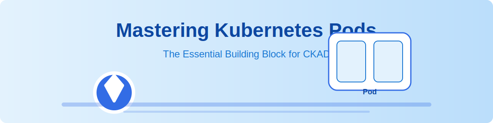

# Master Pod - CKAD Journey



## Overview

This module focuses on Kubernetes Pods, the most fundamental unit of deployment in Kubernetes. Understanding Pods thoroughly is crucial for the Certified Kubernetes Application Developer (CKAD) exam and for real-world Kubernetes deployments.

## Contents

### [Mastering Kubernetes Pods: The Essential Building Block](./pod-mastery.md)

A comprehensive article covering everything you need to know about Kubernetes Pods:

- What is a Pod?
- Pod Anatomy
- Pod Lifecycle
- Creating and Managing Pods
- Pod Configuration Best Practices
- Multi-Container Pods
- Pod Networking
- Resource Management
- Security Contexts
- Troubleshooting Pods
- Exam Tips for CKAD
- Hands-on Lab

## Diagrams

This module includes several visual aids to enhance understanding:

- [Pod Concept](./images/pod-concept.svg)
- [Pod Anatomy](./images/pod-anatomy.svg)
- [Pod Lifecycle](./images/pod-lifecycle.svg) 
- [Pod Best Practices](./images/pod-best-practices.svg)
- [Multi-Container Patterns](./images/multi-container-patterns.svg)
- [Pod Networking](./images/pod-networking.svg)
- [Pod Security Context](./images/pod-security.svg)
- [CKAD Tips for Pods](./images/ckad-tips.svg)

## Hands-on Exercises

1. **Basic Pod Creation**: Create a simple Pod running an Nginx container
2. **Multi-Container Pod**: Implement a Pod with sidecar container pattern
3. **Resource Management**: Configure resource requests and limits
4. **Health Checks**: Implement liveness and readiness probes
5. **Security Context**: Configure Pod and container security context

## Quick Reference

```bash
# Create a Pod
kubectl run nginx --image=nginx

# Create a Pod from a YAML file
kubectl create -f pod.yaml

# Get information about Pods
kubectl get pods
kubectl get pod nginx-pod -o yaml
kubectl describe pod nginx-pod

# Delete a Pod
kubectl delete pod nginx-pod
kubectl delete -f pod.yaml

# Get Pod logs
kubectl logs nginx-pod
kubectl logs -f nginx-pod  # Stream logs

# Execute commands in a Pod
kubectl exec -it nginx-pod -- /bin/bash
```

## Additional Resources

- [Official Kubernetes Documentation on Pods](https://kubernetes.io/docs/concepts/workloads/pods/)
- [Kubernetes Pod Patterns](https://kubernetes.io/blog/2016/06/container-design-patterns/)

---

[← Back to CKAD Journey](../README.md)