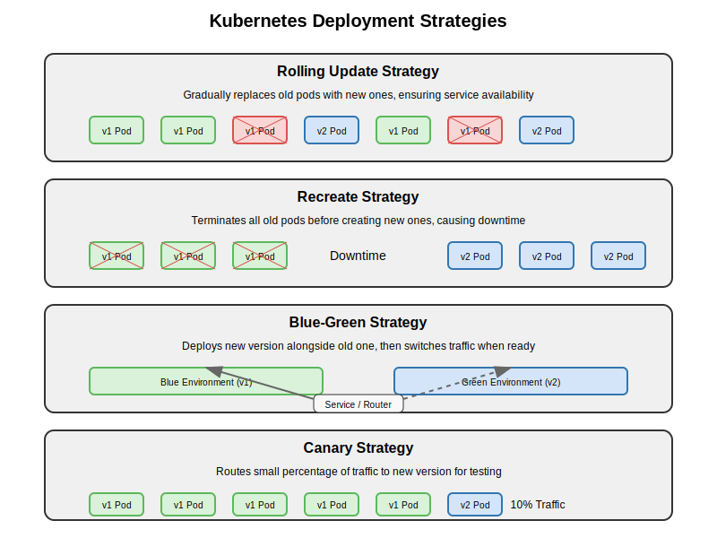
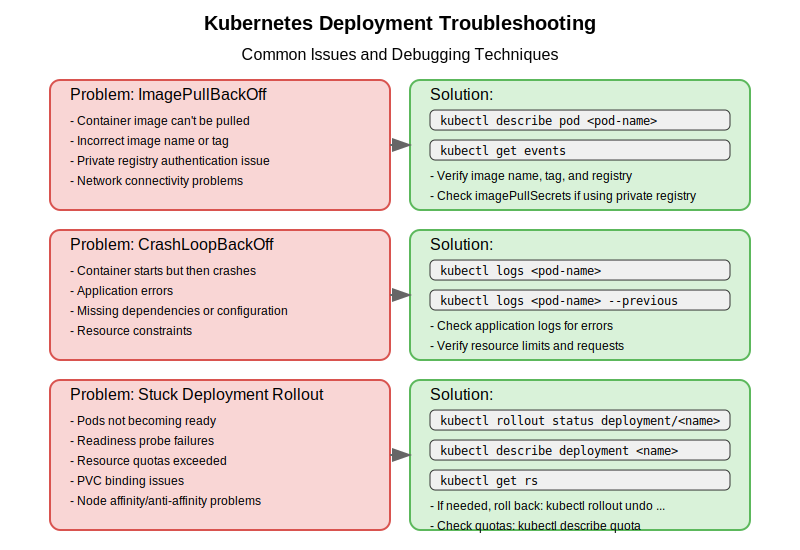

# Kubernetes Deployment Strategies and Troubleshooting

This guide covers advanced deployment strategies and troubleshooting techniques for Kubernetes Deployments, essential knowledge for the CKAD exam and real-world kubernetes administration.

## Advanced Deployment Strategies

Beyond the basic RollingUpdate and Recreate strategies, there are several patterns you can implement using Kubernetes resources:



### Blue-Green Deployments

Blue-Green deployment involves running two identical environments (blue and green), with only one active at a time. This allows for zero-downtime deployments with immediate rollback capability.

**Implementation in Kubernetes**:

1. Create two identical Deployments with different versions:
   - Blue Deployment: running the current version
   - Green Deployment: running the new version

2. Use a Service to direct traffic to the active deployment:

```yaml
apiVersion: v1
kind: Service
metadata:
  name: my-app
spec:
  selector:
    app: my-app
    version: v1  # Initially points to blue deployment
  ports:
  - port: 80
    targetPort: 8080
```

3. Test the green deployment thoroughly

4. Switch traffic by updating the Service selector:

```yaml
kubectl patch service my-app -p '{"spec":{"selector":{"version":"v2"}}}'
```

5. If issues occur, switch back to the blue deployment

6. Once confirmed working, the old deployment can be scaled down or removed

### Canary Deployments

Canary deployments involve gradually routing a small percentage of traffic to a new version to test it with real users before full rollout.

**Implementation in Kubernetes**:

1. Deploy the current version:

```yaml
apiVersion: apps/v1
kind: Deployment
metadata:
  name: my-app-stable
spec:
  replicas: 9  # 90% of traffic
  selector:
    matchLabels:
      app: my-app
      version: stable
  template:
    metadata:
      labels:
        app: my-app
        version: stable
    spec:
      containers:
      - name: my-app
        image: my-app:1.0.0
```

2. Deploy the canary version:

```yaml
apiVersion: apps/v1
kind: Deployment
metadata:
  name: my-app-canary
spec:
  replicas: 1  # 10% of traffic
  selector:
    matchLabels:
      app: my-app
      version: canary
  template:
    metadata:
      labels:
        app: my-app
        version: canary
    spec:
      containers:
      - name: my-app
        image: my-app:2.0.0
```

3. Create a Service that selects both versions:

```yaml
apiVersion: v1
kind: Service
metadata:
  name: my-app
spec:
  selector:
    app: my-app  # Both versions have this label
  ports:
  - port: 80
    targetPort: 8080
```

4. Gradually increase the canary version replicas and decrease the stable version replicas until fully migrated

### A/B Testing

A/B testing is similar to canary deployments but focuses on testing features rather than stability:

1. Deploy version A and version B
2. Route specific users to each version based on criteria (headers, cookies, etc.)
3. Use specialized ingress controllers or service meshes like Istio for traffic splitting

## Troubleshooting Deployments



### Common Deployment Issues

#### 1. Pods Not Starting

**Symptoms**: Pods remain in Pending, ImagePullBackOff, or CrashLoopBackOff state

**Troubleshooting Steps**:

1. Check Pod status and events:
```bash
kubectl get pods
kubectl describe pod <pod-name>
```

2. Check logs:
```bash
kubectl logs <pod-name>
kubectl logs <pod-name> --previous  # For crashed containers
```

3. Common causes and solutions:
   - **Pending**: Resources unavailable - check node capacity
   - **ImagePullBackOff**: Invalid image name, registry authentication issues
   - **CrashLoopBackOff**: Application errors, invalid configuration

#### 2. Failed Rollouts

**Symptoms**: Deployment stuck at status "x out of y new replicas have been updated"

**Troubleshooting Steps**:

1. Check Deployment status:
```bash
kubectl rollout status deployment/<deployment-name>
```

2. Check ReplicaSets:
```bash
kubectl get rs
kubectl describe rs <new-replicaset-name>
```

3. Check failing Pods:
```bash
kubectl get pods -l <deployment-selector>
kubectl describe pod <failing-pod>
```

4. Solutions:
   - Fix issues with the new Pods
   - Roll back to previous version:
     ```bash
     kubectl rollout undo deployment/<deployment-name>
     ```

#### 3. Scaling Issues

**Symptoms**: Deployment doesn't scale to the desired number of replicas

**Troubleshooting Steps**:

1. Check resource quotas:
```bash
kubectl describe quota -n <namespace>
```

2. Check nodes for resource constraints:
```bash
kubectl describe nodes
```

3. Check Pod affinity/anti-affinity rules or node selectors

#### 4. Deployment Updates Not Applied

**Symptoms**: Changes to Deployment don't result in new Pods

**Troubleshooting Steps**:

1. Check if only non-template fields were changed (they don't trigger rollout)
2. Check if the update was properly applied:
```bash
kubectl describe deployment <deployment-name>
```
3. Verify the changes by checking the Pod template:
```bash
kubectl get deployment <deployment-name> -o yaml
```

### Debugging Techniques

#### Using Debug Containers

Starting with Kubernetes 1.18, you can attach a debug container to a running Pod:

```bash
kubectl debug -it <pod-name> --image=busybox --target=<container-name>
```

#### Interactive Troubleshooting with a Temporary Pod

```bash
kubectl run debug --rm -it --image=busybox -- /bin/sh
```

#### Accessing Services from a Temporary Pod

```bash
kubectl run curl --rm -it --image=curlimages/curl -- curl http://my-service
```

### Deployment Health Checks

Add readiness and liveness probes to your Deployments to improve reliability:

```yaml
spec:
  containers:
  - name: my-app
    image: my-app:1.0.0
    livenessProbe:
      httpGet:
        path: /health
        port: 8080
      initialDelaySeconds: 15
      periodSeconds: 10
    readinessProbe:
      httpGet:
        path: /ready
        port: 8080
      initialDelaySeconds: 5
      periodSeconds: 10
```

### Deployment Strategy Selection Guidelines

| Strategy | Use When | Avoid When |
|----------|----------|------------|
| RollingUpdate | - Need zero downtime<br>- Application supports N-1 compatibility | - Cannot have multiple versions running<br>- Limited cluster resources |
| Recreate | - Need complete version isolation<br>- Downtime is acceptable | - Zero downtime is required<br>- User experience is critical |
| Blue/Green | - Need immediate rollback capability<br>- Need to test the whole system before switching | - Limited resources<br>- High cost of running duplicate systems |
| Canary | - Need to test with real users<br>- Want to gradually migrate | - Application doesn't work with multiple versions<br>- Need to make quick updates |

## CKAD Exam Tips for Deployment Troubleshooting

1. **Know how to check Deployment status**:
   ```bash
   kubectl get deployment <n>
   kubectl describe deployment <n>
   ```

2. **Understand how to check Pod status**:
   ```bash
   kubectl get pods -l <deployment-selector>
   kubectl describe pod <pod-name>
   ```

3. **Know how to check logs**:
   ```bash
   kubectl logs <pod-name>
   kubectl logs -l app=<app-name>
   ```

4. **Be familiar with common error states**:
   - Pending, ImagePullBackOff, CrashLoopBackOff
   - Error messages in Pod events

5. **Understand rollback operations**:
   ```bash
   kubectl rollout history deployment/<n>
   kubectl rollout undo deployment/<n>
   ```

6. **Practice debugging scenarios**:
   - Fix a failing Deployment
   - Fix a failing rolling update
   - Investigate why Pods aren't starting

## Conclusion

Understanding advanced deployment strategies and troubleshooting techniques is crucial for the CKAD exam and real-world Kubernetes administration. By mastering these concepts, you'll be able to deploy applications more effectively and solve issues when they arise.

Remember that Deployments are just one part of a larger application architecture. They typically work alongside Services, ConfigMaps, Secrets, and potentially Ingress controllers to create a complete application environment.